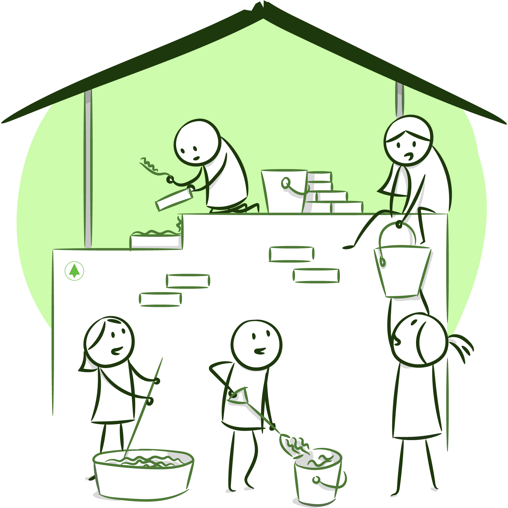
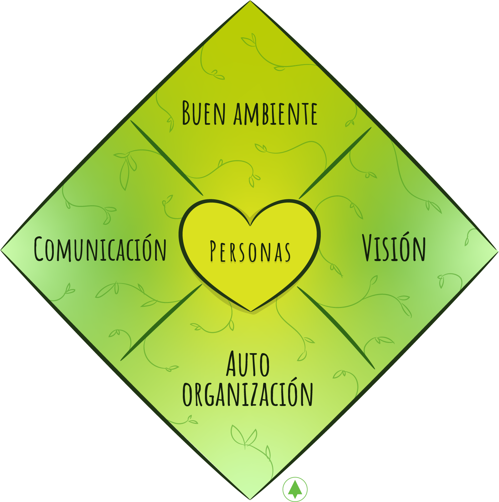
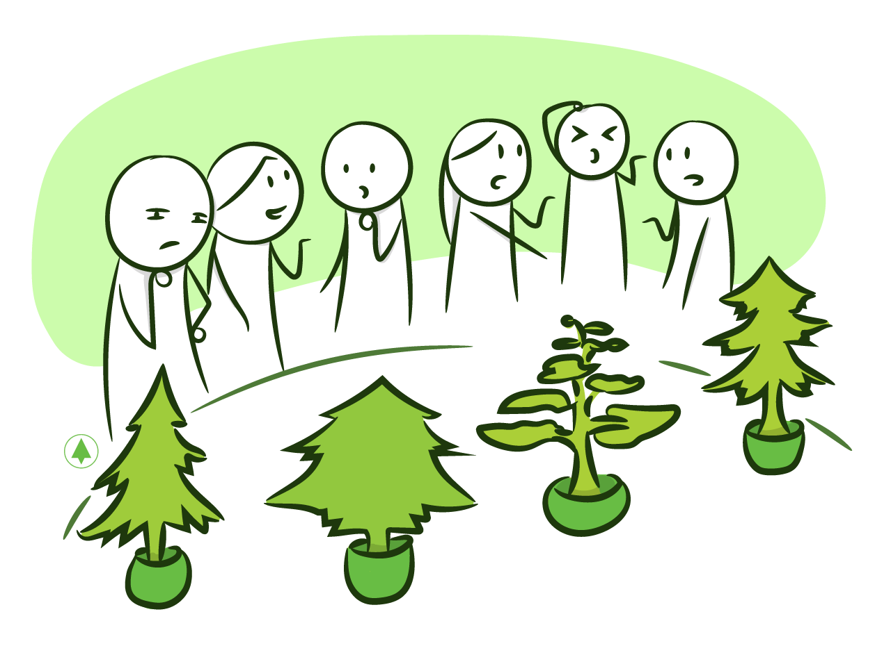
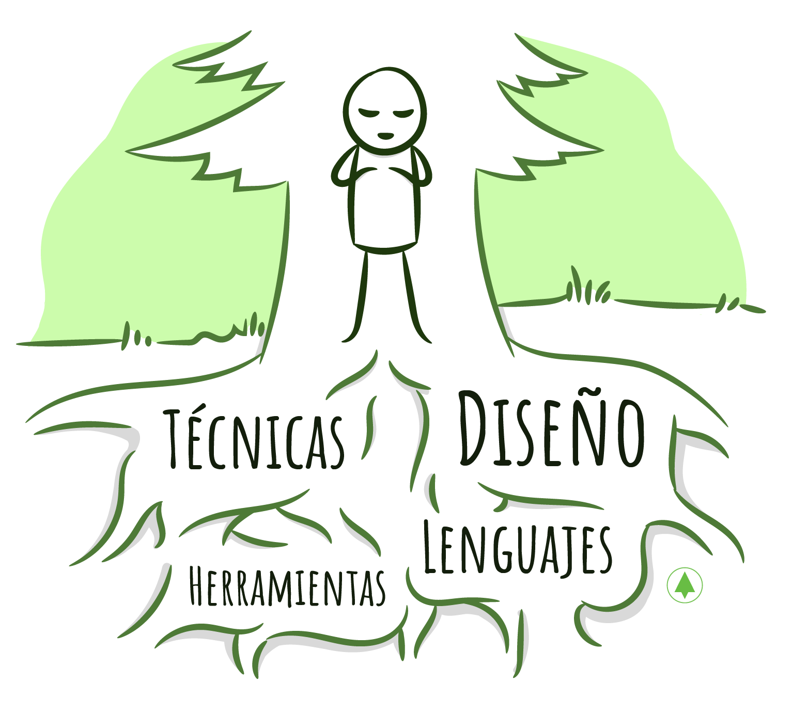
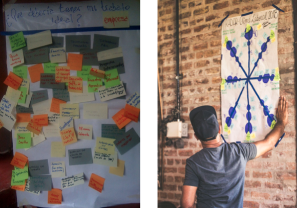
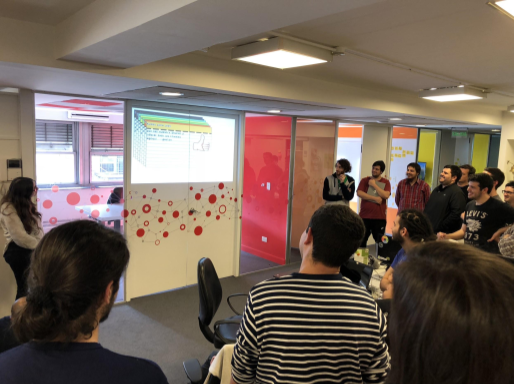
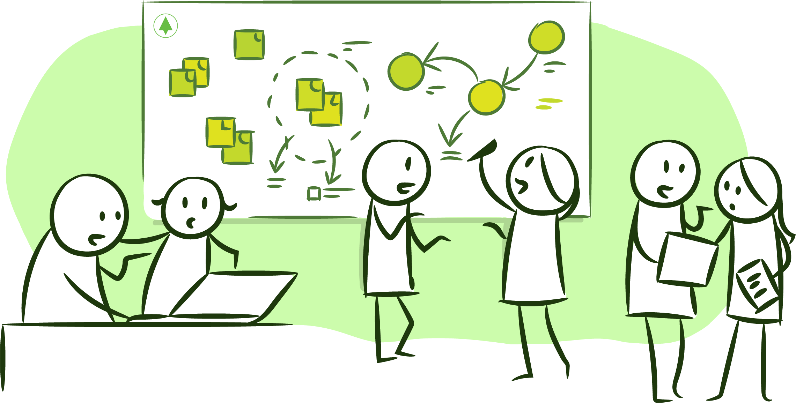
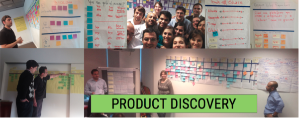
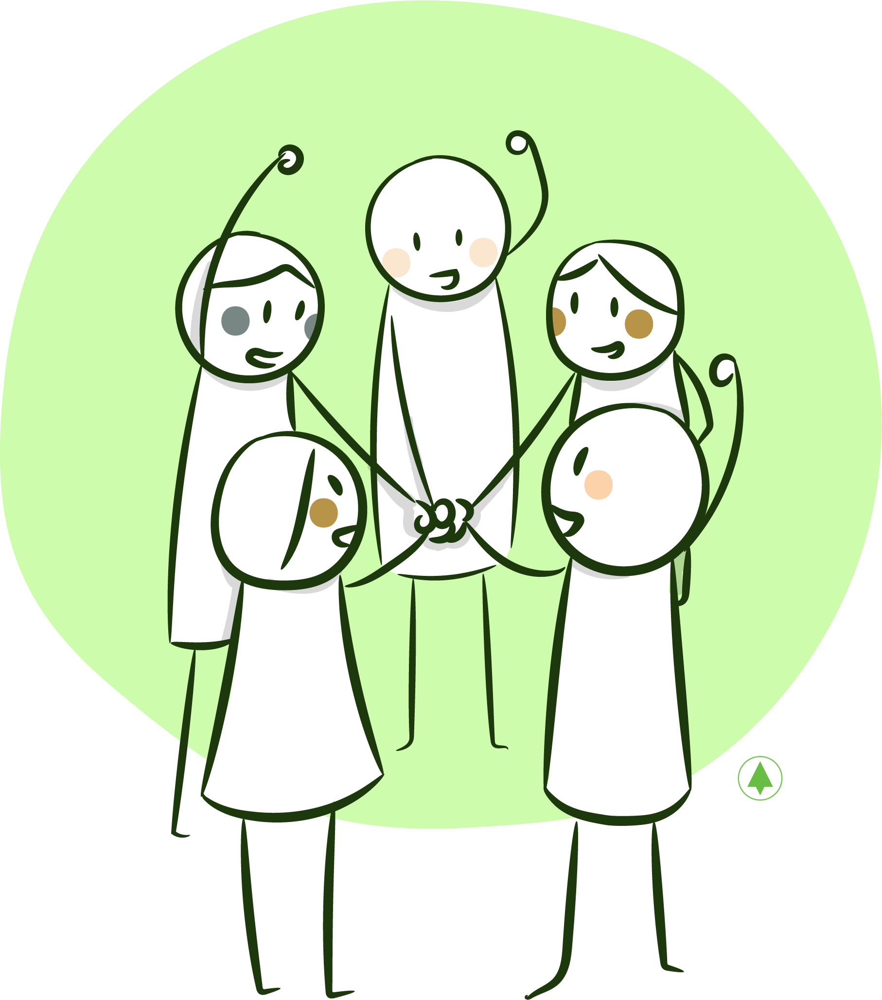

# El corazón de los Equipos Ágiles en 10Pines

El desarrollo de software se hace en equipos. Un equipo no implica la reunión de un grupo de personas. Es mucho más que eso, tiene identidad. Todos los integrantes colaboran. Tienen el mismo objetivo, un sentido de compromiso y solidaridad y sienten que aportan valor. Tom de Marco los denominó ‘equipos consolidados’ \(en inglés, [_Jelled Teams_](https://g.co/kgs/624M1r), que toman forma, como la gelatina cuando se cocina\).

¿Tuvieron la suerte de trabajar en un equipo así? Conformados por integrantes capaces y motivados, dispuestos a dar lo mejor de sí. Comparten objetivos y planes, están comprometidos y empoderados. Se respira la energía del grupo y la sinergia que puede alcanzarse es increíble.

¿Qué hace que un equipo funcione bien? ¿Cuáles son sus valores? ¿Cómo se forma?

Primero, y como diría cualquier chef, es fundamental la materia prima, los ingredientes: **En 10Pines, buscamos personas con ‘madera de pino’**, sólidas técnicamente y que amen desarrollar software. Además, deben ser honestos y querer ser parte de la empresa.

Para que estas personas rindan al máximo, debemos **crear un ambiente dentro del cual puedan florecer**. Donde confíen, puedan expresarse sin ningún tipo de miedo y volcar su talento. Un lugar que les permita seguir creciendo, desarrollarse, aprender y donde se sientan motivados y energizados.

La visualización de los objetivos por parte del equipo dispara la inteligencia colectiva. **En 10Pines, trabajamos para establecer una visión compartida** tanto del futuro de la empresa como de cada uno de los proyectos que enfrentamos.

**A partir de esta visión, nos auto-organizamos** para trazar un plan y trabajar en pos de los objetivos. **Estamos empoderados** para contribuir a la solución y lo hacemos con toda nuestra energía. 10Pines es una empresa horizontal que yace en el poder de las personas y de la auto-organización.

Finalmente, reconocemos que **la comunicación es clave para el éxito**. Por esta razón, **nuestra Metodología maximiza el ancho de banda**, procurando la mayor eficiencia posible. Trabajamos en un _open-space_, participamos en las reuniones \(reduciendo _hands-offs_\), acortamos ciclos y usamos herramientas de gestión y comunicación.

Describiré nuestra receta usando el formato propuesto por Alistair Cockburn en su [Corazón de la Agilidad](https://heartofagile.com). Lo denominé ‘El Corazón de los Equipos Ágiles en 10Pines’.

El corazón está compuesto por las personas. Sin un buen ambiente, no es posible auto-organizarse efectivamente. Establecer una visión clara es parte de una buena comunicación, pero es tan importante que, creo, merece estar en su cuadrante. La auto-organización funciona de modo eficiente con personas como las descritas, en un buen ambiente y con una visión clara. Pueden ver que estos atributos están relacionados, son interdependientes.

# **¿Cómo formamos los equipos?**

Primero, seleccionamos las personas más adecuadas para integrarlos. Muchos me han preguntado: ¿cómo es posible que todos participen? Quienes así consultan piensan que esta modalidad favorecería la toma individual de decisiones. Esto no sucede. Somos responsables y buscamos el bienestar colectivo.

Los equipos están conformados por integrantes dedicados a tiempo completo. Esto es mejor para la productividad, la calidad y para las personas, que pueden concentrarse sin sufrir interrupciones. Dentro del equipo existen todos los _skills_ necesarios para desarrollar un incremento de funcionalidad: que los equipos sean interdisciplinarios permite una gestión mucho más simple y efectiva.

Pueden notar que los equipos no presentan ninguna característica especial. Son conformaciones circunstanciales, auto-organizadas para atender clientes y proyectos. No existen fricciones o contradicciones con la empresa[^1]. Comparten valores, principios y prácticas.

# **Los Equipos son las Personas**

Analicemos cada uno de los atributos que hacen a los buenos equipos, empezando por el corazón. Los equipos son las personas. Las empresas, también. No se puede desarrollar software con gente desmotivada, en la cual no confiamos. Tampoco, ser ágiles. **Necesitamos buenos desarrolladores, honestos, responsables y colaborativos.**

En esta sección les hablaré sobre las personas, el ingrediente fundamental de los equipos. Les contaré cómo seleccionamos las semillas, sus atributos y describiré el ‘camino del pino’, nuestro plan de carrera.

## Proceso de Selección

Como sabemos que las personas son importantes, invertimos mucho tiempo en el proceso de selección. No buscamos programadores con ciertos _skills_ para ingresar a un proyecto particular. **Buscamos programadores que deseen desarrollar su vida profesional en 10Pines**. En consecuencia, somos muy estrictos en la evaluación técnica. También queremos conocer, tanto como sea posible, su parte humana. Con estos objetivos hemos ideado nuestro proceso de selección.

Como mencioné anteriormente, **la excelencia técnica es parte de nuestro ADN**. No creemos que se pueda hacer software con programadores que no sean fuertes técnicamente, que no sepan diseñar o testear. Los postulantes desarrollan un ejercicio usando el lenguaje de programación de preferencia. A continuación, debatimos las decisiones de diseño tomadas, las abstracciones creadas y el proceso utilizado para llegar a ellas \(¿usaronTest Driven Development?\). No hacemos foco en el aspecto tecnológico o en los detalles del lenguaje.

El costado humano resulta difícil de evaluar en un periodo de tiempo tan corto. Para lograrlo, **organizamos una entrevista grupal en la que participamos todos los integrantes de la empresa**. El objetivo es conocer al candidato en profundidad, evaluando si es alguien con quien nos gustaría trabajar. Piensen que compartiremos muchísimas horas de nuestro día con él o ella.

## _**Skills**_ **de los Pinos**

Seguramente les resultará una ‘verdad de Perogrullo’[^2] si les digo que para desarrollar software se necesita gente que sepa desarrollar software. Es necesario saber modelar una solución disciplinadamente, usando las prácticas ingenieriles correctas.

¿Qué significa ‘saber’ desarrollar software? ¿Qué implica ‘ser’ un buen programador? Considero que los buenos desarrolladores con los que he trabajado a lo largo de los años poseen esta combinación de _skills_:

* **Comprenden el dominio en profundidad**: ¿Cómo puedes modelar algo sin conocerlo plenamente? Los buenos programadores buscan entender en profundidad los conceptos que forman parte del problema que enfrentan. Investigan, preguntan y se empapan del dominio.
* **Saben diseñar**: Tienen habilidad para plasmar en el modelo las abstracciones correctas. Ser un buen diseñador se aprende, a partir de cursos y compartiendo proyectos junto a programadores experimentados. Sin embargo, creo que los mejores tienen algo de innato.
* **Dominan el lenguaje de programación**: Dominar el lenguaje permite enfocarse en la resolución del problema, creando, además, soluciones más ‘elegantes’. Conocer los usos y costumbres \(lo que llamamos [_idioms_](https://en.wikipedia.org/wiki/Programming_idiom)\) hace que nuestro _codebase_ luzca bien.
* **Técnicas**: Considero que un buen programador debe ser prolijo y disciplinado para construir software, usando _test driven development_, refactorizando continuamente e integrando tan pronto como sea posible. Estas técnicas se vuelven fundamentales cuando trabajamos en un equipo, para poder sincronizar y colaborar correctamente.
* **Herramientas**: Finalmente, es importante conocer en profundidad las herramientas que usamos diariamente en nuestro trabajo: la IDE, sus atajos, sus diferentes vistas y sus funcionalidades. También el versionador de código. El desarrollo debe fluir sin que existan ‘fricciones’.

Junto con las habilidades ‘duras’ que les nombré, se van desarrollando otras, ‘blandas’, como la comunicación, la gestión de proyectos y el liderazgo. La comunicación implica una doble faz: la capacidad de hablar ante propios y extraños y la capacidad de facilitación dentro del equipo. Las de gestión se relacionan con el conocimiento de la Metodología de 10Pines, por ejemplo facilitar los talleres de _product discovery_ o gestionar un _backlog_ . El liderazgo implica la capacidad para entender el sistema y ayudar a co-crearlo, estableciendo las reglas y restricciones. En otras palabras, los líderes ya tienen los _skills_ para trabajar en la creación del ambiente de trabajo que deseamos. También tienen la capacidad de guiar al resto de los pinos a través de sus caminos.

## El camino del pino

Llegar a ser un buen programador implica un recorrido, que nosotros llamamos ‘Camino del Pino’. Durante el trayecto, crecemos y nos desarrollamos tanto humana como profesionalmente. Hemos definido un marco de referencia: comenzamos como ‘_Padawans_’, copiando y aprendiendo de pinos más experimentados. Nos convertimos luego en ‘_Knights_’, programadores experimentados y con conocimientos de gestión. Después de muchos años, alcanzamos el ‘rango’ de ‘_Masters_’, programadores expertos, conocedores de la profesión en profundidad. El lector podrá deducir de qué saga hemos extraído los nombres.

Durante las etapas iniciales del camino, como ‘_Padawans_’, los hitos consisten en mejorar los _skills_ de programación, es decir, aprender lenguajes, _frameworks_, técnicas, herramientas y participar con responsabilidad y compromiso de las actividades del equipo. Los ‘_Knights_’ son programadores capaces de resolver la mayoría de los problemas de forma autónoma. Tienen una visión más amplia del sistema, que incluye factores como la seguridad y la performance. Toman responsabilidad en parte de la gestión del proyecto y ayudan a sus pares. Dominan varios lenguajes de programación y manejan las herramientas que usamos diariamente \(git, ide\) a la perfección. En la última etapa del camino están los _Masters_, nuestros líderes, encargados de crear y fomentar el mejor ambiente laboral posible. Ellos guían a los más jóvenes por sus caminos y también trabajan para que 10Pines siga creciendo, obteniendo nuevos clientes y manteniendo la relación con los existentes.

Una empresa autogestionada, como la nuestra, suma actividades a sus integrantes que otras no tienen, como por ejemplo, _staffear_ los equipos de trabajo, organizar eventos y alquilar la oficina. Los pinos asumimos compromisos gradualmente que impactan dentro de nuestro crecimiento profesional.

Evaluamos de forma continua el progreso, para saber en qué lugar del camino estamos y, en consecuencia, hacer ajustes y planear objetivos. Para ello, elegimos un ‘jardinero’, de mayor _seniority_ obviamente, que nos acompaña en el recorrido.

Este camino es fundamental, tanto para cada uno de nosotros, los pinos, que, como trabajadores del conocimiento, valoramos la motivación intrínseca, como para 10Pines, que desea que las personas crezcan aquí. En consecuencia, invertimos mucho esfuerzo en ‘señalizarlo’. Evaluamos constantemente cómo está funcionando y qué podemos hacer para mejorarlo.

# **Un buen ambiente**

Una vez que tenemos buenas semillas, **debemos crear un ambiente donde éstas puedan florecer en su mejor expresión, desarrollándose al máximo**. Debe ser un lugar que nos permita volcar todo nuestro talento, donde nos sintamos libres, sin miedo, confiados, motivados y energizados. Debe ser un ambiente de innovación, que despierte la imaginación y dispare las ideas. También, un lugar que nos haga sentir orgullosos por lo que hacemos. Los programadores necesitamos saber que lo que estamos haciendo aporta valor.

Trabajar en un ambiente así permite que los talentos de todas las personas se combinen y hagan sinergia para obtener los mejores resultados. No quedan dudas de que, cuando todos colaboramos, el producto resultante es mejor. Como resultado adicional, esto nos estimula, nos motiva. Esta es la manera en la que trabajamos en 10Pines. No imagino hacerlo de otro modo.

¿Cómo podemos crear este ambiente? **¿Cómo podemos configurar las reglas de este sistema complejo, que es la organización, para alentar estos sentimientos y comportamientos?** En esta sección, les contaré lo que hemos construido, entre todos, en 10Pines.

## **¿Qué nos motiva?**

En uno de nuestros primeros retiros estratégicos, hicimos una actividad que tuvo el propósito de consensuar los atributos que debería tener nuestro trabajo ideal. En otras palabras, los factores que contribuirán a nuestra felicidad, a sentirnos bien, cómodos y contentos en nuestra labor diaria.

La 1ra foto muestra la actividad que hicimos para obtener estos atributos y luego priorizarlos. La 2da, una retrospectiva donde evaluamos cómo estamos en cada uno de ellos.

Los factores que acordamos son:

* Proyectos interesantes
* Gestión participativa
* Calidad humana
* Calidad técnica
* Sueldos
* Crecimiento profesional y aprendizaje constante
* Comodidad laboral
* Imagen y reputación

Los que conocen la [teoría X y la teoría Y de McGregor](https://es.wikipedia.org/wiki/Teoría_X_y_teoría_Y) sobre _Management_ podrán notar que, dentro de los atributos que definimos, existen algunos motivadores extrínsecos, como los sueldos y la comodidad laboral. Sin embargo, la mayoría son intrínsecos, es decir, motivadores que provienen de los objetivos desafiantes, de la asunción de responsabilidades, de los logros obtenidos y del reconocimiento consecuente.

Tenemos en cuenta estos atributos en cada una de las decisiones que tomamos: ¿Qué proyectos deberíamos tomar? ¿Cómo deberíamos aumentar nuestros sueldos? Estos valores representan nuestra guía, el consenso de lo importante para el grupo.

Además, una vez al año, durante nuestro retiro estratégico \(una reunión que realizamos con todos los pinos, que trataré en breve\), inspeccionamos estos atributos en profundidad usando la retrospectiva del [radar](https://blog.agilistic.nl/retrospective-do-the-team-radar/): Todos los pinos puntuamos cada una de las ‘aristas’ para luego graficar en la herramienta los promedios obtenidos. De esta manera, podemos visualizar y debatir cómo estamos: ¡Muchas mejoras profundas han surgido de las conversaciones disparadas por esta retrospectiva!

## **¿Qué hacemos para lograr un buen ambiente?**

### **Promover la confianza**

¿Podrías trabajar en un lugar en el que no confías en la empresa o en tus colegas? Creo que no. Resguardarías la información. No te arriesgarías a cometer errores, no colaborarías.

**En 10Pines establecemos una relación de confianza desde el momento del ingreso**. Un ejemplo de esto lo constituye la carga de las horas trabajadas que cada quien realiza para luego calcular su sueldo. Cada una de los procesos creados o las decisiones tomadas están basados en la confianza. Es nuestro valor más importante. Es la base de un lugar sano, colaborativo, donde nos sentimos bien.

### **Ser Transparentes**

La transparencia fomenta la confianza y, por ende, la colaboración. En 10Pines, la información está disponible para su consulta. **Somos una empresa de** [**números abiertos**](https://en.wikipedia.org/wiki/Open-book_management): cualquiera puede ver los ingresos de la empresa, la rentabilidad de los proyectos y, también, lo percibido por cada pino.

Cuando desarrollamos un proyecto, usamos todas los recursos disponibles para aumentar la transparencia, como por ejemplo, [radiadores de información](https://www.agilealliance.org/glossary/information-radiators/) o herramientas de gestión online. Buscamos que los integrantes del equipo cuenten con la mayor cantidad de información posible, acerca de los objetivos, del progreso y de todas las aristas que puedan tener alguna incidencia en el resultado final.

### Compartir objetivos

Cuando conformamos equipos para construir un producto, compartimos los objetivos, que definimos en el _product discovery_. ¿Qué pasaría si éstos fueran personales? Por ejemplo, si se midiera la performance de los programadores únicamente por su desempeño individual \(_user stories_ terminadas\) o si los integrantes del equipo pertenecieran a otras áreas, con fines contrapuestos. Seguramente, enfrentaríamos comportamientos competitivos y disfuncionales. Las reglas que especificamos en un sistema complejo determinan las conductas de sus agentes que, deseamos, sean colaborativas. El éxito del grupo debe ser el éxito de cada uno de los integrantes. **Los objetivos de 10Pines son los objetivos de todos nosotros**.

### **Hacer los procesos justos**

Un punto muy importante dentro de la transparencia es que los procesos sean justos, que las reglas estén claras. En el articulo ‘[Fair Process: Managing in the Knowledge Economy](https://hbr.org/2003/01/fair-process-managing-in-the-knowledge-economy)’, se explica su importancia para los trabajadores del conocimiento.

**En 10Pines, los procesos y políticas se encuentran claramente definidos en una web de acceso irrestricto**. Cuando surgen aspectos que no tenemos contemplados en ninguna política, nos juntamos, debatimos, consensuamos una y la publicamos en la web mencionada. Al ser una empresa de estructura horizontal, todos nos encargamos de respetar y hacer respetar estos procesos co-creados.

### **Tomar las Decisiones en Equipo**

Con este nivel de transparencia, confianza y colaboración, las decisiones deben tomarse de manera compartida. De esta manera, aseguramos que los integrantes estén comprometidos. **En 10Pines, cualquier grupo que se conforme posee un carácter abierto**, es decir, cualquier pino puede integrarlo. Y tomamos las decisiones entre todos.

Trabajar de este modo puede resultar más lento e incómodo. Sin embargo, como uno de los líderes de 10Pines, puedo asegurarles que es muy gratificante. Valoramos sentirnos escuchados.

### **Crear Espacios de Reconocimiento Personal**

Otro de los factores necesarios para sentirnos bien es el reconocimiento. Que una persona con la que trabajamos nos diga que estamos haciendo las cosas bien aumenta la autoestima y motiva intrínsecamente.

La [pirámide de Maslow](https://es.wikipedia.org/wiki/Pirámide_de_Maslow) muestra que el reconocimiento es parte de nuestras necesidades esenciales, después de la seguridad y de la confianza. El ser humano precisa tanto ser reconocido como demostrar reconocimiento.

**En 10Pines, nos gusta reconocer un buen trabajo**. Lo hacemos todo el tiempo, por ejemplo, cuando alguien nos ayuda a resolver un problema o prepara una charla. Publicamos estos reconocimientos mediante ‘[La muralla de Kudos](https://kudos.10pines.com/)’. Esta herramienta, basada en las cartas de _Kudos_ de _Management 3.0_, fue desarrollada por uno de nuestros pinos, Joaquín, para ‘enviar’ _kudos_ virtuales a otro/s pino/s a través de [slack](https://slack.com), que luego compartimos durante el standup semanal. ¡Se siente muy bien aparecer en la muralla y también agradecer a alguien de esta manera!

### **Fomentar Momentos de Distensión**

Me gusta salir a tomar una cerveza y mantener conversaciones fuera del ámbito laboral con mis compañeros de trabajo. Estos momentos permiten relajarnos y conocernos. Crean lazos fuertes que luego nos permiten trabajar mejor. **En 10Pines, jugar juegos de mesa, compartir un** _**after-office**_ **o ver películas constituyen una costumbre positiva**. Entre nosotros existen vínculos que van más allá del trabajo.

## **Las 5 disfunciones de las empresas**

¿Conocen [este libro](https://g.co/kgs/LVoPh5) de Patrick Lencioni? Me ayudó a entender algunas situaciones completamente disfuncionales que se daban en algunas de las empresas donde trabajé. El autor las describe a través de esta pirámide:

La primera disfunción, en la base, es la **falta de Confianza**, que nace de la no-voluntad a mostrarse vulnerable frente al grupo. Si los miembros del equipo no confían entre ellos, entonces no piden ayuda y ocultan información. En definitiva, hacen lo que es mejor para ellos mismos y no para el grupo.

La falta de confianza genera **miedo al conflicto**. Si los miembros del equipo no confían entre ellos, entonces no discuten. Si en un equipo nadie discute, ¡desconfíen! En 10Pines, tienen lugar debates, argumentos y discusiones, dentro de un ambiente saludable. Son actividades constructivas. Cuando uno está comprometido, convencido de que su postura es la correcta, discute con vehemencia.

La imposibilidad de razonar constructivamente es la principal causa por la cual **los miembros no se comprometen con las decisiones** que se toman. Si no participaste de la discusión, ¿tú lo harías?

Miembros que no se comprometen son **miembros que no son responsables** ¿Puede requerirse el seguimiento de un plan a un integrante en estas circunstancias?

Finalmente, los miembros no responsables crean un ambiente donde la 5ta disfunción florece: **No atención a los resultados**.

Este libro me ayudó a entender que, en ocasiones, ciertos comportamientos son el resultado de problemas más profundos. Sólo observamos los síntomas. He visto, por ejemplo, equipos se comunican a través de herramientas \(Jira\) para dejar ‘evidencia’ o testers que incluyen un reporte de _bugs_ antes de aceptar la _user story_. En algunas ocasiones, cometí el error de centrarme en los síntomas, queriendo hacer los procesos más eficientes, cuando los problemas eran humanos, de falta de confianza y colaboración. Las personas, como agentes inteligentes dentro de este sistema complejo que es una organización, maquillan los problemas, desplazan el eje o se acomodan según intereses propios. Por el contrario, cuando se brinda confianza y se empodera a las personas, los integrantes están comprometidos y velan por los resultados.

# **Visión**

> **“Si no sabes para donde vas, cualquier camino te llevará allí" - Lewis Carroll**

Como ya mencioné en el capítulo 1, comenzamos los proyectos haciendo un **product discovery** del que participa todo el equipo y que permite construir una visión compartida. Aquí consensuamos los objetivos y el plan para alcanzarlos. Dicha visión nos permite volcar todo nuestro talento en busca de las mejores soluciones. **Es el disparador de la inteligencia colectiva, el energizante que dispara las interacciones necesarias**. Sienta las bases para que se produzca el mejor tipo de colaboración. Somos agentes inteligentes, empoderados, en un ambiente que nos alienta para dar lo mejor de nosotros.

10Pines funciona exactamente del mismo modo. **Todos los pinos construimos la visión de la empresa**, que repasamos y refinamos cada año, durante nuestro retiro estratégico. Esta visión nos guía, nos permite tomar las decisiones diarias.

# **Auto-organización**

Compartida la visión, reconocidos los objetivos, **el equipo se auto-organiza para empezar a trabajar**. Todos participamos opinando, debatiendo o planteando alternativas. Contribuimos a la solución. Estamos empoderados.

Habiendo contemplado una empresa auto-gestionada durante los últimos 9 años, no me quedan dudas: representa la mejor forma de trabajo. **Permite alcanzar resultados óptimos porque combina los talentos del grupo. E impacta en nuestro bienestar**: representa uno de los factores esenciales en la creación de un buen ambiente laboral.

## **¿Qué logramos con la auto-organización?**

¿Por qué se obtienen mejores resultados cuando se trabaja de esta manera? A continuación describo algunas razones:

**Tenemos perspectivas parciales, que se combinan:** Crear la solución entre todos los integrantes del equipo permite que la misma sea equivalente a la suma de los talentos individuales: ¿Por qué prescindir de ideas, perspectivas y mentes de personas inteligentes y capaces? [Management 3.0](https://www.amazon.com/Management-3-0-Developers-Developing-Addison-Wesley/dp/0321712471) detalla el ‘principio de la oscuridad’, que explica la razón por la cual, desde el punto de vista de la complejidad, resulta positiva la auto-organización: ‘Los miembros de un equipo de desarrollo poseen un modelo mental incompleto del sistema’. Cuando éstos se combinan, dicho modelo se completa, obteniendo ideas mejores que las que hubieran podido obtenerse por separado.

**Tenemos diferentes** _**backgrounds**_ **y** _**skills**_**, que se potencian:** Nuestro trabajo, como desarrolladores de software, es un trabajo de creación y de innovación que requiere de un equipo diverso, con diferentes _backgrounds_ y _skills_, que interactúe libremente. El [video de ABC Nightline sobre IDEO](https://www.youtube.com/watch?v=M66ZU2PCIcM) describe muy bien cómo debe crearse un ambiente de innovación: no existe un jefe, sino un facilitador, en una estructura completamente horizontal donde los integrantes tienen perfiles muy diversos. Se brinda un objetivo y se deja al equipo auto-organizarse. Debido a que el problema es altamente caótico, se fija un lapso de tiempo para su finalización. Suena familiar, ¿no?

**Somos personas formadas, en contacto con los problemas:** El 5to principio en el libro de “[_Lean Software Development_](https://g.co/kgs/Cf4dUX)” habla sobre Empoderamiento: ‘Empleados educados y empoderados, guiados por un líder, pueden tomar mejores decisiones que sus _managers_’, sugiere. El método científico de Taylor no fue pensado para organizaciones del conocimiento. En éstas, delegar ‘es mucho más efectivo porque estos ingenieros, trabajando en la línea de producción, tienen mejor información y, también, la formación necesaria para tomar esas decisiones’. El desarrollo de software es exactamente igual. Los programadores somos profesionales capacitados, que trabajamos en la ‘línea de producción’.

**Somos los que mejor sabemos como contribuir:** Cada integrante es quien mejor conoce sus propios _skills_ y, por ende, quien mejor sabe cómo contribuir al equipo en función de los objetivos compartidos. Por esto, Jim Highsmith, en [_Agile Project Management_](https://g.co/kgs/pzb6LH), especifica que ‘cada una de las personas se hace responsable del pasaje de trabajo \(de acuerdo a la necesidad\), del manejo de su propia carga y de la efectividad del equipo’. ¿Existe modo superador de gestionar un proyecto?

**Es la mejor manera de atacar la complejidad:** Los ‘sistemas adaptativos complejos’ describen científicamente cómo funciona la auto-organización: la solución ‘emerge’ a partir de la interacción de agentes inteligentes que toman decisiones diarias con un impacto en la solución final. Los proyectos de desarrollo de software son sistemas adaptativos complejos. La auto-organización permite atacar la complejidad inherente, a través de la participación de todos los integrantes \(agentes\) en el producto final. Dejarla en manos de una persona sería demasiado arriesgado.

**Nos hace sentir mejor y más comprometidos:** Cuando una persona capaz está motivada, quiere participar en las decisiones y en el devenir del proyecto. Siente, al hacerlo, una motivación intrínseca: una necesidad interna por alcanzar una conclusión exitosa. John Buck y Gerard Endenburg, en ‘[_The Creative Forces of Self Organization_](http://sociocracyconsulting.com/wp-content/uploads/2016/04/CreativeForces-updated2012.pdf)’, argumentan que, cuando se trabaja de esta manera, no existen fricciones entre los intereses personales y los de la empresa. Nuestra energía se encauza hacia objetivos compartidos. Sentirnos motivados, energizados y trabajar auto-organizadamente en un equipo nos vuelve personas más responsables con nuestros pares y nosotros mismos. Esta responsabilidad nace de los deseos intrínsecos. Es diferente de la que podría originarse al ser reprendidos o premiados. Puedo decirles, sin temor a equivocarme, que nunca vi, en todos mis años de experiencia, equipos y personas tan comprometidas como en 10Pines.

## **Auto-organización en 10Pines**

10Pines es una empresa horizontal gestionada por todos los que formamos parte. Estamos empoderados para participar y lo hacemos con gusto. Compartimos la responsabilidad de llevar adelante la empresa. Colaboramos para resolver los problemas. Me gusta trabajar de esta manera y siento que a todos los pinos también. De hecho, como ya vieron, se encuentra dentro de las aristas que valoramos colectivamente. Sentirnos partícipes de lo que hacemos nos motiva y todos nos sentimos partícipes de 10Pines.

No voy a contarles demasiados detalles de cómo nos organizamos. Creo que ésto merece un libro por sí mismo. Solo quería comentarles que, al momento de escribirlo, somos más de 80 personas auto-organizadas para gestionar 10Pines. Tenemos equipos auto-conformados que se ocupan de tareas diarias que deben hacerse en todas las empresas, como el _recruiting_, la gestión del hardware o la configuración de la red. Conformamos equipos espontáneos para organizar eventos particulares, como una conferencia o, incluso, la fiesta de fin de año. Nos reunimos mensualmente para compartir los números de la empresa y tomar decisiones importantes como, por ejemplo, en qué proyectos trabajar y quiénes conformarán los equipos.

Por supuesto que la gestión participativa implica un gran desafío a la hora de tomar decisiones. Sin embargo, a pesar de las dificultades e incomodidades que puedan originarse, el efecto positivo de participar en las decisiones y de saber que el proceso es justo nos llena de energía y de confianza.

## **Líderes en 10Pines**

Les conté que en 10Pines nos auto-organizamos para gestionar la empresa. También, que no existen jefes. Podrán pensar ustedes que es un ambiente caótico, casi anárquico, pero nada dista más de la realidad. Existe un sistema, conformado por valores, procesos y reglas, que funciona muy bien.

Y existen líderes, que son las personas más experimentadas, las que mejor conocen la empresa. **Ellos sentaron las bases de la cultura. Configuraron el contexto. Fijaron los objetivos, el rumbo y las restricciones**. Los procesos que forman parte de nuestra columna vertebral, como el _recruiting_ o las reuniones estratégicas mensuales, fueron diseñados por ellos.

Al ser quienes mejor conocen los valores y la visión de 10Pines, se encargan de transmitirlos al resto de los pinos diariamente, en reuniones, eventos y frente a hechos relevantes, que marcan puntos de inflexión en la vida de la empresa. Hablan mucho con los pinos más jóvenes, alinean expectativas y se preocupan por su motivación. Son los ‘jardineros’, que guían a las personas a través del camino del pino. Aconsejan y brindan sus puntos de vista. En ambientes como el nuestro, sin estructuras formales, los líderes tienen un brillo particular. Son reconocidos por lo que hacen y transmiten, más que por sus títulos.

Claramente los fundadores son los líderes principales. Sin embargo, no son los únicos. Después de casi 10 años de existencia, muchas otras personas han tomado posiciones de liderazgo. Estos ‘_masters_’, que conocen la empresa íntimamente, participan en áreas vitales de la misma. Sin ellos, 10Pines no funcionaría del mismo modo.

## Disciplina

Quizás piensen que los equipos de estas características carecen de disciplina, pero no es cierto. Puedo asegurarles que **en 10Pines los equipos son auto-disciplinados, rigurosos con los procesos y las prácticas y responsables para cumplir los objetivos** teniendo en cuenta las restricciones. Cuando un grupo de personas competentes trabaja de esta manera, tomando responsabilidad colectiva por los resultados, la auto-disciplina \(así como también, la auto-organización\) sucede naturalmente.

Jim Highsmith expresa que ‘la auto-disciplina hace posible la libertad y el empoderamiento’ y continúa diciendo que ‘uno de los peligros más grandes de los desarrollos centrados en procesos y de la gestión de proyectos es la reducción de los incentivos para la auto-disciplina. Posteriormente, comenta que ‘algunos _project managers_ se preguntan por qué nadie toma la iniciativa y es responsable’.

Un punto que también vale la pena mencionar dentro de este tópico es l**a necesidad de trabajar disciplinadamente para lograr excelencia técnica**. Esta disciplina no puede ser impuesta, ya que requiere de una práctica constante por parte de todos los integrantes del equipo. Las prácticas de _Extreme Programming_ permiten crear esa ‘presión de pares’ que nos lleva a trabajar de ese modo. Hacer _pair programming_ y _code reviews_ nos impulsa a buscar mejores diseños, a pensar cuidadosamente los nombres, a no dejar deuda técnica, a testear cuidadosamente y a evitar atajos**.**

# **Comunicación**

> **“Algunos de nosotros estamos en el negocio de la tecnología. La mayoría estamos en el negocio de la comunicación humana.” - Tom de Marco**

Reconocemos la importancia de la comunicación. Por eso nos esforzamos en que sea lo más caudalosa y efectiva posible.

Alistair Cockburn define, en [_Agile Software Development_](https://g.co/kgs/wUnzS8), la comunicación como ‘la transmisión de una idea desde una persona a otra’. Cuando trabajamos en un equipo, emitimos diariamente conceptos, que se plasman en especificaciones y, en definitiva, en el _codebase_ que representa la solución.

Lograr una buena comunicación es difícil. Existen malas interpretaciones, incluso cuando charlamos con nuestras parejas. ¡Imaginen en un equipo, con gente que conocemos menos y tenemos poco contacto!

La comunicación, dentro del enfoque de construcción de software que hemos elegido, el enfoque ágil, es crucial: Un equipo multidisciplinario, motivado y organizado desarrolla pequeños incrementos de funcionalidad para obtener feedback rápido. Este proceso, altamente concurrente, ya que implica la interacción de todos los roles que forman parte del equipo, requiere que fluya un caudal enorme de comunicación entre sus integrantes.

En consecuencia, **debemos usar los medios de comunicación más eficientes y efectivos** a nuestro alcance: aumentar el ancho de banda de comunicación tanto como sea posible, que existan radiadores de información que disparen nuevas conversaciones, que fluya en todas direcciones y que sea directa, es decir, sin intermediarios.

## **¿Cuál es la manera más eficiente de comunicarse?**

Sin duda, estar con la persona o personas con las cuales queremos comunicarnos frente a frente, ya que podemos observar su lenguaje corporal y aumentar la velocidad al notar la comprensión o detenernos en caso de observar dificultades. Desde el punto de vista del receptor, podemos interrumpir, permitiendo que el emisor aclare, para continuar sobre bases sólidas. ¿Cuál es la manera menos eficiente? La comunicación escrita, donde el emisor genera un documento para que otras personas lean e interpreten. No solo es más lento, sino también más proclive a errores. Entre una y otra, podemos encontrar diversos métodos alternativos como _Google Hangouts_, que permite visualizar a las personas y compartir la pantalla o _Slack_ , que posibilita la creación de grupos con los cuales se comparte información masivamente.


Gráfico original de [Efectividad de la comunicación](https://g.co/kgs/RVkx3i) con nuevas herramientas \(la evaluación de su efectividad está basada en un juicio propio\).


En 10Pines procuramos que los equipos se comuniquen de modo efectivo: se trabaja en un _open space_, donde los integrantes se sientan juntos de modo de maximizar la [comunicación osmótica](bibliografia.md#Cockburn00). Cuando trabajamos desde casa, nos reunimos virtualmente usando _Hangouts_ o _Skype_. Usamos herramientas para chatear y para gestionar el proyecto, como _Jira_ o _Pivotal Tracker_. Desarrollamos haciendo _pair programming_ y hacemos _code review_. Todas estas prácticas y herramientas resultan esenciales para mejorar la comunicación.

Muchos de los equipos en los que trabajamos son distribuidos, conformados con desarrolladores de 10Pines y _product owners_, _testers_ y _scrum masters_ en otras ubicaciones del globo. En estos casos, analizamos y definimos como lograr la comunicación más eficiente posible, reconociendo que, cuando las personas no comparten la misma ubicación, se genera un menor caudal de información. Para lidiar con esta situación, multiplicamos las reuniones y hacemos un uso, aún más, intensivo de las herramientas digitales.

# **Conclusión**

No buscamos personas para un proyecto en particular, sino personas que deseen desarrollar su vida profesional dentro de 10Pines. Nuestro proceso de selección evalúa fuertemente los aspectos técnicos sin dejar de lado el aspecto humano.

Creemos que es fundamental sentirnos bien, trabajar en un ambiente transparente, honesto y colaborativo porque permite brindarnos al máximo. Por esta razón, continuamente evaluamos cómo nos sentimos y qué podemos mejorar. Poseemos un camino de crecimiento, que llamamos ‘Camino del Pino’, que facilita nuestro desarrollo. Poder crecer profesionalmente impacta en nuestra felicidad.

Construimos una visión compartida, tanto en 10Pines como en cada uno de los productos que desarrollamos, que nos permite estar alineados y colaborar eficientemente.

El empoderamiento resulta esencial para desarrollar el mejor producto posible y, también, para gestionar una empresa. Además, nos compromete, disciplina, motiva y hace felices.

Finalmente, buscamos una estrategia que maximice el bandwidth de comunicación, al considerarla vital para el desarrollo de software.

Alistair lo denomina ‘un juego de invención y cooperación’: un equipo de _crafters_ colabora entre sí para que la solución emerja, aportando cada uno desde su perspectiva.

---

# Notas al Pie

[^1]: ¿**Equipos Ágiles en empresas no Ágiles?**

En el pasado, trabajé en equipos ágiles, dentro de empresas que no lo eran. Reconocía la importancia de la auto-organización para lidiar con la complejidad y alcanzar un mejor grado de colaboración. Sin embargo, la empresa poseía una estructura jerárquica. Además, competíamos duramente por lograr un bono que era repartido entre pocos. Eso generaba grandes discrepancias que repercutían tanto en la performance colectiva como en la motivación de cada uno de los integrantes. Reportar a un jefe externo o lidiar con personas, que no comparten la modalidad de trabajo y los valores, afecta la moral y la motivación. Me pregunto si en estas situaciones existe un techo de cristal que limita a estos equipos.

[^2]: Expresión del habla coloquial que funciona como sinónimo de obviedad.

