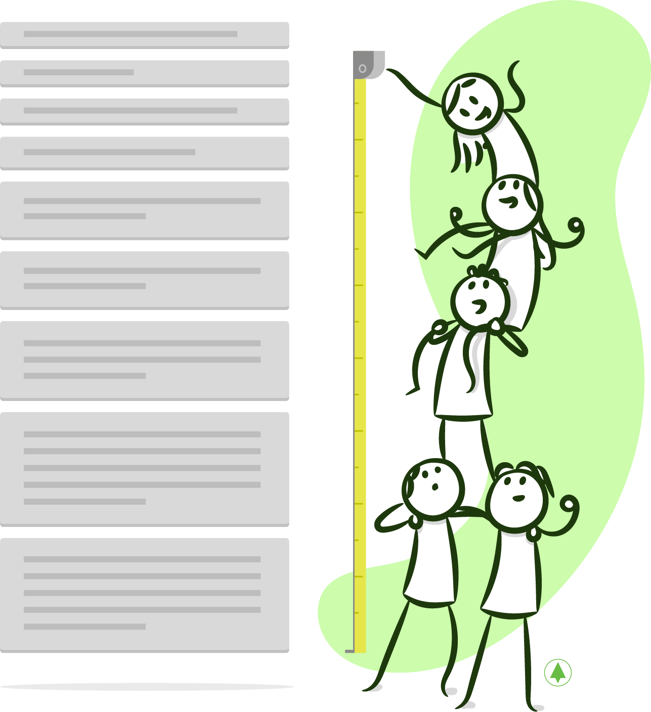
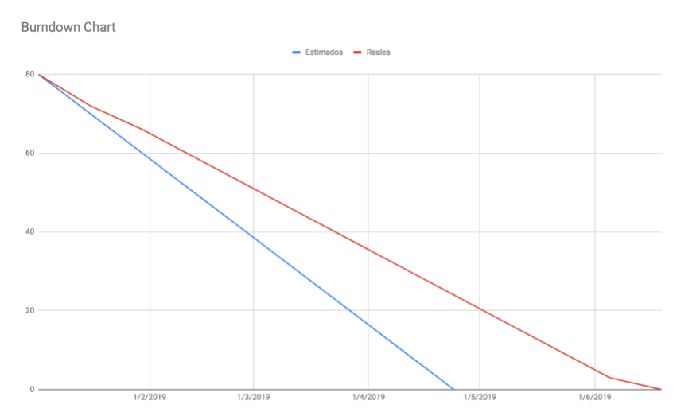

# **Una Primera Noción del Tamaño**

Una vez que tenemos esta primera versión del _Backlog_, **necesitaremos saber cuán grande es el producto a construir para estimar el costo y también para planear un equipo** que, teniendo en cuenta las restricciones de tiempo y dinero, lo desarrolle.

**Hacemos la estimación inicial de la manera más rápida y eficiente posible**, sin perder tiempo en adivinanzas y especulaciones, usando la técnica de [Planning Poker](https://es.wikipedia.org/wiki/Planning_poker) para asignar [Story Points](https://www.mountaingoatsoftware.com/blog/what-are-story-points) a cada una de las _User Stories_ descubiertas. Noten que estimamos incrementos de funcionalidad visibles. Esto es fundamental para la posterior gestión del proyecto, ya que medimos el progreso del mismo en base a funcionalidad terminada.

Deberemos arriesgar el tiempo que involucraría 1 _Story Point_, para inferir cuánto nos llevaría completar todo el proyecto. Esta primera estimación carga con mucha incertidumbre, ya que se hace con poca información \(tanto del negocio como de la parte técnica posiblemente\). Usaremos esta estimación para construir el plan inicial, pero será fundamental durante las primeras semanas entender mejor la dimensión del producto y también la capacidad real del equipo \(_Velocity_\).

He mencionado unos cuantos conceptos sobre los que, desde mi punto de vista, vale la pena profundizar. En las secciones que siguen, les contaré más sobre estimaciones relativas, _Story Points_, _Planning Poker_, la _Velocity_ y sobre cómo usamos estos conceptos para el planeamiento y la gestión del proyecto.

# **Estimaciones Relativas usando** _***Story Points***_

Durante muchos años de mi vida realicé estimaciones en tiempos absolutos. Para hacerlas, desagregaba los componentes que, entendía, debían desarrollarse y asignaba tiempos (que luego sumaba) para cada uno de ellos. Usé puntos de función y complejas planillas de cálculo creadas dentro del marco de estándares de calidad como [CMMI](https://es.wikipedia.org/wiki/Capability_Maturity_Model_Integration) \(que procuraban tener métodos estandarizados para la organización\). Ninguna de estas técnicas resultó, en mi experiencia, en estimaciones precisas, generando siempre comportamientos disfuncionales que terminaron siendo perjudiciales para la organización. Un ejemplo que todos conocerán es el que consta en agregar un "_padding_" a la estimación, para "cumplir" con los tiempos. ¿Les parece que tiene sentido?

Cuando empecé a trabajar con Scrum, descubrí el concepto de estimaciones relativas usando _Story Points_. Con esta técnica, no estimamos cuánto esfuerzo demanda completar una _User Story_, sino **cuánto demanda una con respecto a otra**. Asignamos puntos, que llamamos _Story Points_, como resultado de estas comparaciones relativas. Así, una _User Story_ que tiene asignado 2 requerirá el doble de esfuerzo que otra de 1 y 2/3 de una tercera de 3. **Estos puntos amalgaman todos los factores que pueden influir en el esfuerzo**, entre los que puedo nombrarles[[Cohn]](bibliografia.md#cohn00-cohn-mike-user-stories-applied-for-agile-software-development-marzo-2004):

* **Cantidad de Trabajo**: ¿Es un formulario con 3 o 10 campos? ¿Involucra mucho testing?
* **Incertidumbre**: ¿Conocemos el negocio? ¿Las funcionalidades están cerradas o hay puntos abiertos? ¿Es una tecnología que conocemos o es nueva y no tenemos experiencia? ¿Tenemos que interactuar con servicios desconocidos?
* **Complejidad**: Volviendo al ejemplo del formulario, ¿los componentes usados son sencillos? ¿Involucran validaciones? ¿Están interrelacionados?

Los valores que pueden ser usados como _Story Points_ pertenecen a una escala discreta, por ejemplo, la [Sucesión de Fibonacci](https://es.wikipedia.org/wiki/Sucesi%C3%B3n_de_Fibonacci). **Limitarnos a valores discretos simplifica notablemente el proceso**. Cuando estimamos de esta manera, podemos imaginar que tenemos baldes que representan cada uno de los valores y luego decidimos a cuál asignar cada _User Story_. De este modo, evitamos discusiones que aportan muy poco valor, como si debiéramos asignar 2.5 o 2.7. ¡No disponemos de tanta información como para ser tan precisos! Los valores discretos incorporan intrínsecamente este grado de incertidumbre. La sucesión de Fibonacci es particularmente intuitiva en este sentido, ya que las distancias entre los números de la sucesión crecen a medida que los números se vuelven más grandes.

Si bien es bastante frecuente usar _Story Points_, estos no son fundamentales dentro del concepto de estimaciones relativas. Pueden usar talles de remera, como en el gráfico que se encuentra abajo, o cualquier otra medida. El punto es que cada número, por sí mismo, carece de sentido. Toma sentido cuando se mide en comparación con otro.


¿Por qué usamos estimaciones relativas? **La primera razón es que vuelven el proceso más sencillo y liviano**, ya que no nos detenemos en tratar de adivinar lo que no conocemos o en investigaciones que haremos cuando empecemos a trabajar. Además, las estimaciones relativas nos desplazan de razonamientos tales como "esta _User Story_ la desarrollará una persona determinada por sus _skills_ o _seniority_" que no tienen ningún sentido. Simplemente decidimos, como equipo, cuanto más grande o más chica es una _User Story_ con respecto a otra. La segunda razón es que realizar las estimaciones de esta manera nos protege de cualquier intento de presión \(por parte de Jefes/_Project Managers_, etc.\) a través de la existencia de este nivel nuevo de indirección. Estas presiones siempre generan, como ya mencioné, conductas que no son beneficiosas para nadie.    

****

# ¿Qué se tiene en cuenta al realizar una estimación? 

Un punto a tener en claro, antes de estimar, es qué significa completar una _User Story_. No basta con haber "codeado" la funcionalidad. Debemos, como mínimo, ejecutar exitosamente todos los casos de prueba y el _Product Owner_ debe validar y aceptar la _User Story_. Además, deben existir _tests_ automatizados para toda la nueva funcionalidad, que cobrarán vital importancia para su posterior regresión.

Todos estos puntos, y quizás algunos otros que se agreguen para algún proyecto u organización en particular, constituyen la [*definition of done*](https://www.scruminc.com/definition-of-done/). No tiene sentido escribirlos en cada _User Story_ porque están implícitos, aplican a todas. **Es muy importante que todo el equipo entienda lo mismo**. En otras palabras, que para todos signifique lo mismo completar una _User Story_. Una actividad que podemos realizar, para asegurarnos de ésto, consiste en armar un afiche con la lista de los criterios definidos. Una vez creado, podemos pegarlo cerca de nuestros escritorios, para que funcione como un [radiador de información](http://alistair.cockburn.us/Information+radiator).

# ***Planning Poker***

Usamos esta técnica para asignar estimaciones a las *User Stories*. Para ello, invitamos a todo el equipo que participará del proyecto (desarrolladores, testers, diseñadores y _product owners_\), entregándoles mazos similares al que se encuentra abajo, donde cada una de las cartas representa un número de _Story Points_:


La explicación del funcionamiento de esta técnica yace en la teoría de la [sabiduría de las masas](https://es.wikipedia.org/wiki/Sabiduría_de_los_grupos), que argumenta que la participación de todo el equipo incrementa la precisión de las estimaciones al escuchar las perspectivas de todos los integrantes. Que una persona sola, por más que sea un experto, realice todas las estimaciones implica un riesgo mucho mayor ya que es muy probable que omita factores poco visibles en su rol.

El proceso para hacer las estimaciones con esta técnica es el siguiente:

1. El _Product Owner_ describe la _User Story_, qué desea lograr y cómo aportará valor.
2. Se debate brevemente. ¿Qué implica? ¿Qué riesgos existen? Escuchar las diferentes perspectivas es fundamental para enriquecer las nuestras.
3. Se deja un momento para que cada persona piense y elija su carta.
4. A la cuenta de 3, todos al mismo tiempo mostramos la carta seleccionada: ¡No queremos que nadie se sienta influenciado!
5. Contamos cuántas personas eligieron cada carta. En general, la distribución es una campana de Gauss, ya que la mayoría suele elegir un valor y sólo unos pocos eligen uno superior o inferior.
6. Es bueno escuchar a los _outliers_, es decir, aquellas personas que tienen estimaciones muy bajas o muy altas ya que pueden tener información que el resto desconoce u omite. Por supuesto que también pudo desconocerse o malinterpretarse algún punto de la _User Story_. De igual modo, resulta relevante escuchar sus argumentos y, en base a ellos, decidir si se desea repetir la estimación.
7. ¡Siempre llegamos a un consenso! Al menos, es mi experiencia. Que los valores sean discretos ayuda mucho. Después de todo, sólo estamos decidiendo cuántos _Story Points_ asignar a una _User Story_ y no cuántos días vamos a tardar en completarla.

# **Estimando el** _***Backlog***_

Para finalizar esta sección, les contaré el proceso que usamos para estimar un conjunto de _User Stories_, que podría llegar a ser el _Backlog_ completo o sólo el próximo _release_ \(personalmente no creo que valga la pena hacer una estimación de más de 2 meses de trabajo\).

Empezamos por seleccionar una _User Story_ que esté entre las prioritarias y que consideremos de las más pequeñas del _Backlog_ y le asignamos 1 punto. Luego estimamos, usando _Planning Poker_, la primera _User Story_, es decir la que está en el primer lugar del _Backlog_, estableciendo una comparación con la precedente a la que habíamos asignado 1 punto.

Una vez establecida una estimación para la segunda _User Story_, seguiremos con la tercera, la cuarta y así sucesivamente. Durante los comienzos, puede llegar a surgir la necesidad de algunos ajustes, pero puedo asegurarles que el sistema se estabiliza muy rápidamente y estas primeras estimaciones establecen el parámetro para todos las _User Stories_ que restan en el _Backlog_ \(y para todas las que se descubran en el futuro\).

Como ya lo mencioné, **no creo que tenga sentido invertir una cantidad exagerada de tiempo en esta actividad**. Si ya definimos el Producto Mínimo Viable \(hablaremos sobre este concepto que llamamos MVP en la próxima sección\), nos limitaremos a estimar solamente sus _User Stories_. Si el MVP fuera demasiado grande, sería bueno partirlo en _releases_. Debe tenerse en cuenta que, mientras más _User Stories_ estimemos, mayor será el riesgo de perder el tiempo en ítems que después no sean construidos. **Tampoco vale la pena invertir tiempo para comprender cada** _**User Story**_ **en profundidad**. Una técnica que empleo habitualmente, para no extenderme, consiste en delimitar el tiempo que se va a usar para la estimación de cada _User Story_ \(5 minutos puede ser adecuado\). Otra opción consiste en, de ser el equipo numeroso, repartir las _User Stories_ entre 2 grupos para que puedan hacer las estimaciones en paralelo dando lugar a la exposición de los resultados.

# **Costo y Tiempo de Trabajo**

Para comenzar un proyecto, se debe tener una idea de la dimensión del producto a construir, principalmente para conocer el costo y para poder planificar en base a él.

Para hacer la traducción de los _Story Points_ del _Backlog_ a una unidad de tiempo, simplemente estimamos 1 _Story Point_ con el equipo que elegimos infiriendo, de este modo, el tiempo total del _Backlog_.

Visualicemos esto mediante un ejemplo. Imaginen que estimamos nuestro _Backlog_ inicial en 75 _Story Points_ y pensamos en un equipo de 3 personas para desarrollarlo. El paso siguiente sería estimar cuánto nos llevaría completar 1 _Story Point_ con este equipo.

Por cuestiones de simplicidad, podríamos estimarlo en 1 día. Es decir, que proyectamos completar 1 _Story Point_ por día.

De este modo, demoraríamos 75 días en terminar o alrededor de 8 iteraciones de 2 semanas \(10 puntos por iteración\). Podríamos incluso inferir, siendo que tenemos nuestro _Backlog_ priorizado, qué funcionalidades entregaríamos en cada una de las iteraciones para planificar de acuerdo a esto. No es una actividad en la que encuentre demasiado valor, por lo que no la fomento.

Si quisiéramos hacer un presupuesto, deberíamos multiplicar este número por la cantidad de personas en el equipo y éste, a su vez, por la cantidad de horas que, en promedio, trabajan esas personas.

En nuestro ejemplo:

```
75 días x 3 personas x 7 horas promedio/día = 1575 horas

Si el costo es u$s 60/hora, el presupuesto para el proyecto sería: 1575 x 60 = u$s 94500
```

Podríamos pensar que existe una similitud entre las horas descritas y las [horas-hombre](https://es.wikipedia.org/wiki/Hora-persona) de la gestión tradicional de proyectos, pero no son exactamente lo mismo. La diferencia, sutil, radica en que las estimaciones para cada una de las _User Stories_ se basan en un equipo, mientras que para la gestión tradicional de proyectos se trata de estimaciones del tiempo que demora un "recurso" en completar una actividad.

# _**Velocity**_ **y** _**Burndown**_


Al comenzar a trabajar, **mediremos la cantidad de** _**Story Points**_ **que podemos terminar en cada iteración**, lo que nos dará una pauta de la verdadera capacidad del equipo. Llamamos a ésto [_Velocity_](https://www.agilealliance.org/glossary/velocity) [[Cohn]](bibliografia.md#cohn00-cohn-mike-user-stories-applied-for-agile-software-development-marzo-2004), que es un término que proviene de la física y que incluye la celeridad y la dirección.

Midiendo la _Velocity_ de la primera iteración, podríamos inferir, con más información que antes de empezar, cuánto nos queda por delante. Sigamos con el ejemplo de la sección anterior e imaginemos que el equipo completa 2 _User Stories_: una de 5 puntos y otra de 3. La _Velocity_ será entonces de 8 puntos. De los 75 puntos estimados, completamos 8 \(en la jerga decimos "quemamos 8" y ya veremos la causa\), o sea que nos quedan 68. Podemos inferir entonces que, si seguimos con esta _Velocity_, necesitaríamos 8.5 iteraciones \(68 / 8\) para terminar.

Al completar la 2da iteración y medir la _Velocity_, dispondremos de mayor información, ya que podremos obtener un promedio de las _velocities_ de las 2 primeras iteraciones. Por ejemplo, si hubiera sido igual a 6, el promedio de las 2 iteraciones sería igual a 7, lo que nos indica que necesitaríamos 8.8 iteraciones más para terminar.

Para visualizar la _Velocity_, podemos usar el gráfico de _Burndown:_



En este gráfico, el eje "Y" indica la cantidad de puntos por quemar y el "X" muestra el tiempo.

En este ejemplo, sobrestimamos nuestra capacidad \(o subestimamos la complejidad del proyecto\). **Con esta información, debemos actualizar nuestro plan**: ¿Podemos extender la fecha de entrega? ¿Podemos acotar el _scope_, dejando algunas funcionalidades para un _release_ posterior? ¿Podríamos aumentar la _Velocity_ sumando a un integrante más? La confianza y la colaboración existentes entre los miembros del equipo permiten dar lugar a estas conversaciones.

**Mike Cohn dice que la** _**Velocity**_ **es el gran ecualizador, ya que nos permite actualizar nuestro plan automáticamente**. Mientras que las estimaciones relativas sean consistentes, la medición de la _Velocity_ nos permitirá inferir un calendario actualizado sin necesidad de efectuar ningún tipo de re-estimación.

# **Aspectos Importantes en las Estimaciones Ágiles**

Me gustaría contarles, para finalizar, cuáles son los puntos fundamentales del enfoque ágil en mi opinión. No son los _Story Points_, ni el _Planning Poker_, sino el proceso que usamos para estimar. En resumen:

* **Se hacen sobre** _**User Stories**_, es decir, sobre incrementos de funcionalidad visibles al usuario final. El progreso, posteriormente, será medido en base a esto.
* **No se invierte mucho tiempo en hacer un análisis detallado** para hacer la estimación, porque la precisión que presumiblemente se podría alcanzar no justifica la inversión. Esto no significa que las estimaciones dejen de hacerse por completo ya que es necesario tener una noción del tamaño para hacer la planificación.
* **No implican un compromiso**. La presión ejercida sobre el equipo, ya sea para acortar los tiempos o para cumplir con la fecha inicialmente estimada, es la principal causa de disfuncionalidad que conozco. Queremos evitar que el equipo sienta la necesidad de poner un _pad_ a la estimación o quiera cortar camino para cumplir con las estimaciones y que consecuentemente agregue deuda técnica. Ninguno de estos comportamientos resulta beneficioso.

# **Conclusión**

En esta sección estudiamos cómo hacer una estimación inicial del producto. Necesitamos tener una idea de la dimensión del mismo para poder planificar el equipo y proyectar tiempos \(de acuerdo a los _deadlines_ y  expectativas del negocio\). No deseamos, ni podemos, saber exactamente cuánto llevará. Tampoco, invertir demasiado tiempo en intentarlo, sin enfrentarnos con los problemas prácticos. No lo considero un buen uso del tiempo. Asumir un compromiso con esta información tampoco me parece razonable y es causa de muchas disfuncionalidades. Cuando comencemos a desarrollar, podremos verificar si las asunciones y estimaciones resultaron correctas, plasmando el conocimiento adquirido en nuestros planes. Usando _Story Points_ y midiendo la _Velocity_, esto es automático.
