""

> #### La parte más dificil de construir un sistema de software es, precisamente, decidir qué construir[[1]](product-discovery.md#notas-al-pie)

# ***Product Discovery***

En 10Pines construimos software para diversos tipos de clientes, desde grandes corporaciones como Claro y Burger King, que quieren desarrollar nuevos productos o ampliar la funcionalidad de herramientas existentes, hasta emprendimientos recién nacidos que buscan construir una versión inicial del producto. Si bien las necesidades, el tamaño del problema y obviamente el presupuesto difieren, siempre comenzamos nuestros desarrollos por una etapa que denominamos ***Product Discovery***, donde nos juntamos con los especialistas en el negocio, nuestros clientes, para crear una **visión compartida** de lo que se desea construir.

El objetivo de esta etapa es entender quiénes serán los usuarios y clientes principales, cuáles son sus problemas y necesidades y cómo las vamos a resolver. Además, tener una idea del tamaño, establecer prioridades, identificar riesgos y acordar cuál es el [producto mínimo viable](https://es.wikipedia.org/wiki/Producto_viable_mínimo).

Existe una diferencia entre la simple comprensión de los requerimientos y el grado de entendimiento e involucramiento que buscamos en esta etapa en 10Pines. Esto es lo que nos permite **alcanzar un intenso grado de colaboración con todos nuestros clientes**. Diseñar una solución es algo muy complejo que se logra a través de la interacción y colaboración de todos estos actores desde el momento en que nos contactan. **El compromiso y la sinergia,** alcanzados por el equipo en esta etapa, son muy importantes. Es por eso que en todos nuestros proyectos diseñamos las soluciones juntos, proponemos y discutimos alternativas y nos enfocamos en alcanzar los objetivos, **maximizando la colaboración y la comunicación**.

# **Fase de Product Discovery**

_Product Discovery_ es la fase inicial de nuestra Metodología. Sentamos aquí las bases de lo que constituirá el resto del desarrollo. Creemos firmemente en los valores ágiles de comunicación y colaboración. Por esta razón, intentamos maximizar el ancho de banda y establecer lazos de colaboración cercanos desde el comienzo.

Facilitamos esta etapa a través de una serie de talleres que desarrollamos en colaboración con nuestros clientes. El resultado es un conjunto de artefactos que nos permitirá establecer un plan para desarrollar el producto. Es importante remarcar que la documentación producida durante esta etapa es creada, de forma eficiente, a través de la colaboración de todos los involucrados, generando, al mismo tiempo, un importante **caudal de conocimiento compartido**.

## **¿Qué es lo que se busca descubrir?**

Antes de describir el proceso y las herramientas que usamos en esta etapa, detallaremos qué es lo que se intenta descubrir:

**Por qué:** ¿Cuáles son los problemas más importantes que desean resolver? ¿Por qué es necesaria esta herramienta? Entender todo esto en detalle nos permite diseñar soluciones mejores, muchas veces sugiriendo alternativas a las inicialmente propuestas por nuestros clientes.

**Quiénes y Qué:** Quiénes son los actores principales y qué procesos de negocios llevarán a cabo en el sistema a desarrollar. Por supuesto, existirán flujos principales y alternativos. En esta etapa detectaremos todos, aunque, después, terminemos priorizando algunos y descartando otros.

**Prioridades:** Si algo aprendí en todos estos años de desarrollo es que el tiempo y el dinero nunca alcanzarán para construir todo lo que se desea. Es por eso que parte de las actividades, que desarrollamos en esta etapa, consiste en identificar cuáles son los _features_ indispensables, es decir, aquellos que no pueden faltar o con los que se obtendrán mayores beneficios. Entender las prioridades y trabajar en ellas resultan fundamentales para el éxito del proyecto.

**Producto Mínimo Viable:** Resulta valioso entender cuál es el experimento mínimo que nuestros clientes están dispuestos a testear con usuarios reales. Sus altas expectativas muchas veces los impulsan a buscar la implementación de todas sus ideas, pretendiendo obtener éxito desde el comienzo. Lamentablemente, en la mayor parte de las ocasiones esto no ocurre. Es por eso que los alentamos a diseñar experimentos más pequeños que testeen sus hipótesis con usuarios reales. Nuestro objetivo es [crear conocimiento validado de la manera más rápida y eficiente posible](http://theleanstartup.com/).

**Modelo de Negocio:** Cuando trabajamos con [_startups_](https://en.wikipedia.org/wiki/Startup_company), creemos que es importante entender cuál es su modelo de negocios, es decir, cómo piensan ganar dinero y cuál es el diferencial del producto. Si el proyecto es para una corporación, entonces es importante entender cuáles son los procesos que esta herramienta optimizará o cómo se obtendrán nuevos ingresos a partir de la misma.

**Riesgos:** Es muy común que en las conversaciones realizadas en esta etapa se detecten riesgos, tanto técnicos como de negocio. Estos deben ser marcados y discutidos, ya que representan información esencial para la posterior priorización de *features*.

**Estimación inicial de la magnitud:** A partir de las conversaciones sostenidas en esta etapa, se puede tener una idea inicial de cuán grande podría llegar a ser el desarrollo.

Marty Cagan, en su libro "_Inspired, how to create products that customers love_"[[Cagan00]](bibliografia.md#cagan00-cagan-marty-inspired-how-to-create-products-customers-love-junio-2008), afirma que para que un producto sea exitoso debe ser **valioso, usable y posible de desarrollar**. La fase de _Product Discovery_ tiene el objetivo de crear una visión compartida de cómo alcanzar estas metas. Para eso debemos entender dónde está el valor del producto, cómo va a ser usado \(su [usabilidad](https://es.wikipedia.org/wiki/Usabilidad)\) y, por supuesto, si técnicamente es factible de construir.

## **Talleres de** _**Product Discovery**_

La mejor forma de hacer este descubrimiento es a partir de un conjunto de reuniones, que realizamos junto con nuestros clientes y en las que empleamos un conjunto de herramientas que permiten que todos los participantes se involucren. Estas reuniones, a las que concurren usuarios de negocios, desarrolladores, testers, especialistas en UX y diseñadores pueden durar desde 4 horas hasta una semana en proyectos de gran magnitud. La diversidad de roles enriquece el resultado, ya que, además de nuestros clientes, que conocen qué se requiere y cuáles son los objetivos, se necesitan desarrolladores que evalúen la factibilidad, testers que contribuyan con su atención a los detalles y especialistas en *UX* que evalúen la usabilidad. Es fundamental que concurran el _product manager_, el _technical leader_ y un facilitador encargado de llevar la reunión adelante, explicar las herramientas que se van a usar y mediar en las conversaciones. Destaco que, más allá de los artefactos producidos, resultan de gran utilidad las conversaciones desarrolladas. ¡Es curioso pero, muchas veces, detectamos que no existe una visión unificada, ni siquiera, entre diferentes integrantes de la misma empresa cliente! Discutir sobre todas las aristas que tendrá el producto, en esta etapa, resulta esencial para unificar el entendimiento y las visiones de todas las personas involucradas en el desarrollo. Jeff Patton llama a esto "comprensión compartida"[[Patton00]](bibliografia.md#patton00-patton-jeff-user-story-mapping-discover-the-whole-story-build-the-right-product-septiembre-2014).

## ***Lean Sales Up*** - por Jorge Silva

El proceso de preventa puede ser doloroso, largo y caro. En esta primer etapa debemos convencer al prospecto que somos la mejor opción, ayudándolo, al mismo tiempo, a definir y ajustar sus expectativas (casi siempre altas). Por lo general, esto termina en una sobre-estimación (el clásico "colchón"), promesas poco realistas sobre alcances y fechas y otros comportamientos disfuncionales que pueden ensuciar la relación desde el comienzo.

Cuando trabajaba en empresas tradicionales, cada vez que alguien me hablaba de la etapa de preventa, me preguntaba: “¿qué cosas imposibles habrá prometido el vendedor?” o “¿cuánto tiempo habrá recortado de la estimación para poder venderlo?”. Estas situaciones resultan frecuentes dentro de un enfoque clásico de ventas ya que el vendedor procura vender todo lo posible, ajustando lo necesario para que el cliente compre. Del otro lado está el desarrollador, que recibe esa venta optimista y debe entregar algo al cliente.

Como podrán imaginar, el proceso de preventa clásico entra en conflicto con el modelo de empresa que tenemos, principalmente porque:

- El precio es conocido sólo por los vendedores y el cliente.
- Las expectativas del cliente son “endulzadas” para cerrar la venta.
- El alcance del proyecto es definido sin el involucramiento del equipo de desarrollo.
- Las fechas son irreales.
- El equipo de desarrollo no se involucra con los objetivos del cliente. 
- Las diferencias entre vendedores y desarrolladores resultan de difícil resolución.

Por otro lado, es una realidad que es necesario vender para mantener la empresa viva. Para poder lograrlo de forma sustentable, elaboramos dos ideas principales:

1. Los desarrolladores debemos vender. "Si quieres hacerlo bien, hazlo tu mismo".
2. Necesitamos integrar las ventas con el desarrollo. 

A partir de estas ideas, redefinimos nuestro proceso de pre-venta, fusionándolo al de desarrollo y alineándolo a nuestros valores. Esto significa que no existe más una etapa de preventa separada del ciclo de desarrollo. En su lugar unimos cada uno de los proceso en uno solo. De esta forma, ambos roles, desarrollo y ventas, son conscientes de la complejidad de ambas actividades. Por otro lado, borramos la frontera entre las dos áreas, creando un equipo más completo, capaz no sólo de desarrollar software, sino también de venderlo y explicarle al cliente por qué somos la mejor opción.

Luego de 10 años de trabajo continuo y mejoras, podríamos decir que nuestro proceso de preventa se basa en estas tres heurísticas:

- **Explicar qué es agilidad:** No todos saben lo que implica, por lo cual debemos transmitir estas ideas al cliente.
- **Descubrir tu producto:** Creamos el taller de “*Product Discovery*”, una herramienta poderosa usada para identificar qué construir, haciendo la preventa más exitosa.
- **Entender la psicología de tu cliente:** Desafiar las ideas de tu potencial cliente, entender cómo piensa, cómo decide, qué necesita y qué no.

Luego de todo este aprendizaje sobre las pre-ventas, terminamos con un proceso de desarrollo ágil que posee esta forma:

En esta imagen se observa que la preventa, fase donde se concibe el producto, es parte del proceso de desarrollo. De esta forma se entiende la venta de modo más holístico, con mayores probabilidades de que sea exitoso el proceso. 

# **Herramientas**

A continuación, describiré algunas de las herramientas que usamos habitualmente en los talleres:

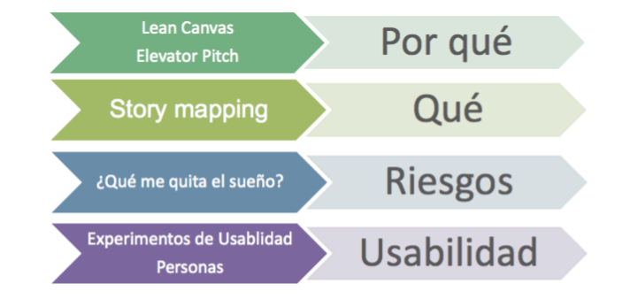

## ***User Story Mapping***

**Introducción**

Aprendí esta técnica cuando vivía en San Francisco, en 2009, en uno de los tantos _open spaces_ a los que asistí. Por ese entonces, yo trabajaba con _Scrum_ o _eXtreme Programming_ desde hacía algunos años y uno de los cuestionamientos que poseía era que el _Backlog_ \(que trataré en el próximo capítulo\) no me dejaba visualizar de manera nítida el trabajo que debíamos realizar. ¿No resulta difícil poder visualizar un producto, a través de una lista de *User Stories*? Descubrir esta herramienta fue realmente un hallazgo para mí.

¿Qué es un _User Story Mapping_? En pocas palabras, **es un mapa que describe los procesos de negocios de cada uno de los actores que forman parte del sistema**, a través de las tareas que deben llevarse a cabo para completar cada uno de estos procesos. La técnica fue popularizada por Jeff Patton dentro del mundillo ágil. El resultado, desde el plano visual, será algo similar a lo que puede verse en la siguiente imagen:

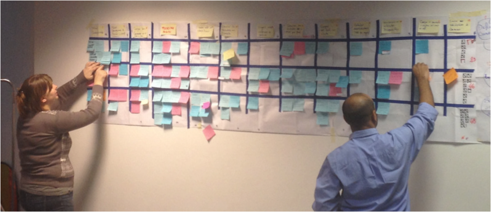

¿Por qué me gusta tanto esta herramienta? Básicamente, porque es:

* **Intuitiva**: Puedo explicarla en minutos a un público completamente nuevo y empezar inmediatamente a construirlo.
* **Fácil de Crear**: Crear una tarea implica solamente escribir un _post-it_ y pegarlo. Cualquiera puede hacerlo sin crear ninguna disrupción. El tiempo se invierte en descubrir estas tareas entre todos y en las conversaciones que se disparan. Los _post-its_ pueden reacomodarse sin ningún esfuerzo, a medida que se descubren nuevas tareas o se repriorizan las existentes.
* **Visual**: El mapa nos permite visualizar a los actores junto a sus actividades principales y a la composición de las mismas. Podemos recorrer estos flujos de negocios, simplemente, leyendo las tareas de izquierda a derecha, algo que resulta intuitivo y natural. También, observar qué es importante, simplemente viendo qué tareas se encuentran arriba de otras. El mapa contiene mucha información, presentada de forma clara.

**Cómo construimos el User Story Map**

Lo primero que se debe hacer es identificar a los actores principales del sistema, es decir, cuáles serán los tipos de usuarios. Muchas veces, resulta dificultosa la identificación de todos los usuarios en una instancia inicial, pero no se preocupen, porque, a medida que avancemos con la construcción del _Story Map_, identificaremos al resto. Por cada nuevo tipo de usuario, pegaremos un _post-it_ que lo identifique, dejando espacio para descubrir todo lo que este podrá realizar en el sistema.

Para graficar la construcción del _story map_, introduciré un ejemplo muy sencillo extraído de un video de nuestro amigo David Hussman[[2]](product-discovery.md#notas-al-pie). Imaginen que deben construir un sistema para un supermercado, que ayude a los empleados que cobran la mercadería. El sistema debe, en pocas palabras, permitir el escaneo de los productos para luego cobrarlos y facturarlos. En consecuencia, el tipo de usuario que identificaremos será el del cajero.

Una vez que identifiquemos al actor principal, trataremos de descubrir cómo usará el sistema, es decir, cuáles serán los principales procesos de negocio bajo su responsabilidad. Jeff Patton los denomina **actividades,** término procedente de expertos en *UX* tales como Larry Constantine y Don Norman, y las define como "grandes cosas que el actor hace y que están conformadas por un conjunto de pasos, pero que no siempre tienen un _workflow_ preciso definido". En mi experiencia facilitando estos talleres, resulta difícil precisar estas actividades en una etapa inicial. Por esta razón, también podemos comenzar preguntando: ¿Qué es lo primero que el usuario hará en el sistema? Ese algo, escrito en forma de verbo, será nuestra 1ra Tarea. Patton define una **tarea** como "algo pequeño, que el usuario hace en el sistema para llegar a un objetivo". Parafraseando: ¿Cuál es la primera tarea que el usuario llevará a cabo en el sistema? Cuando la hayamos identificado, la escribiremos en un _post-it_ que pegaremos debajo del que identifica al tipo de usuario. Posteriormente, buscaremos determinar qué hará a continuación, escribiremos el *post-it* correspondiente y lo pegaremos a la derecha del anterior, señalando la cuestión temporal.

Retomando el ejemplo, ¿qué será lo primero que hará el cajero, cuando nos presentemos con nuestro canasto de compras? Pensaremos nuestro sistema de la manera más simple y diremos que "Ingresará el código de cada uno de los artículos que tiene en el canasto". Llamaremos a esta tarea "Ingresar Código Producto". ¿Qué haremos una vez ingresado el código de todos los artículos? Calcular el total. Llamaremos a la tarea con el mismo nombre y la pegaremos a la derecha del *post-it* anterior.

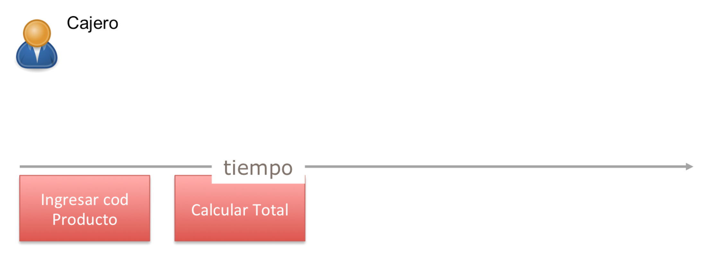

Una vez calculado el total, el cajero deberá cobrar. El medio de pago más sencillo de implementar es con dinero en efectivo, así que escribiremos una tarea que lo represente: "Tomar pago con efectivo". Una vez realizado, "emitiremos el recibo".

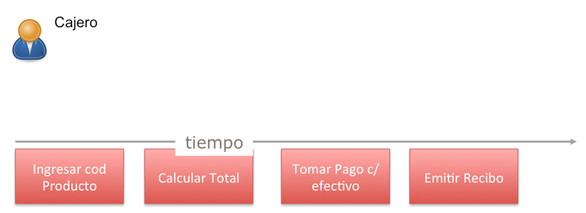

Podemos visualizar rápidamente el flujo de tareas de nuestro tipo de usuario principal.

Seguramente que la charla llevará a querer agrupar estas tareas bajo un proceso de negocio o, como Patton las denomina, una actividad que las identifique. Cuando descubramos esta actividad, escribiremos un _post-it_ de otro color y lo pegaremos sobre el conjunto de tareas que engloba.

¿Cómo podríamos llamar a la actividad que engloba la introducción de todos los artículos y el cálculo del total a pagar? Por razones de simplicidad y falta de otros participantes para discutir el nombre de la misma, la llamaré: "Cargar Productos". Nótese el *post-it* de diferente color sobre la 1ra tarea que comprende.

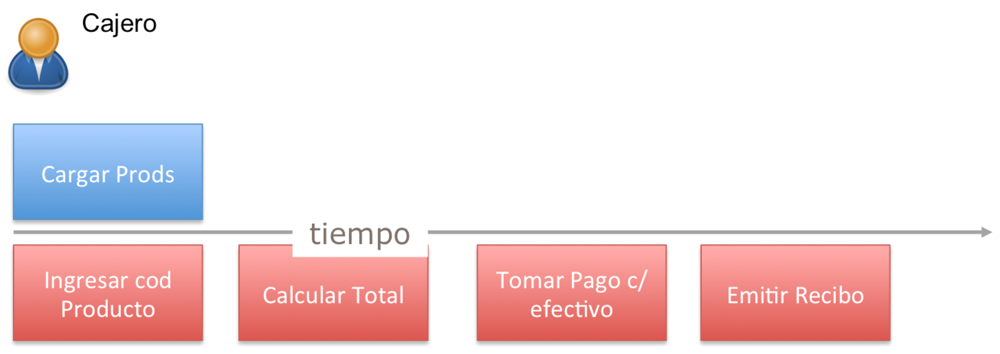

Por las mismas razones, denominaré a la actividad que engloba todas las tareas de cobro: "Cobrar".

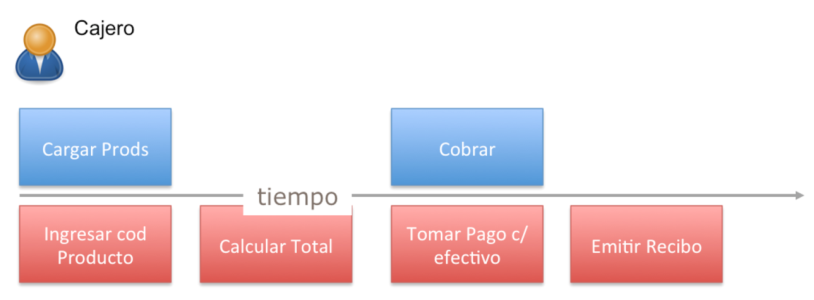

En este ejemplo, hemos partido del descubrimiento de tareas para luego abstraer las actividades. Podríamos haber comenzado también por la identificación de las actividades principales: "Cargar Productos" y "Cobrar" para luego descomponerlas en tareas. En definitiva, ya sea que partamos de la abstracción, es decir, de la actividad y la separemos en tareas o viceversa, de las tareas concretas y, en algún momento, abstraigamos la actividad, el resultado final será el mismo.

Una vez descrita la primera actividad \(y el primer conjunto de tareas\) preguntaremos: ¿qué otras tareas o actividades llevará a cabo en el sistema este usuario? Impulsados por esta interrogación, comenzaremos nuevamente el ciclo detallado.

Seguramente, en algún momento, nos daremos cuenta de que podemos hacer cierta tarea o cierta otra tarea para alcanzar un mismo objetivo \(por supuesto que esto se puede extender a un flujo de tareas\). ¿Qué haremos para representar esto, visualmente, dentro de nuestro _Story Map_? Pegaremos los _post-its,_ que corresponden a las tareas opcionales, debajo de las tareas principales. Nótese que mencioné una tarea principal y una opcional, es decir, que priorizamos y esta priorización queda reflejada en nuestro _Story Map_.

Siguiendo con el ejemplo, imagínese que, en vez de "Ingresar el producto" de forma manual, lo escaneamos \(como usualmente se hace en los supermercados\). Escribiremos la tarea y la pegaremos debajo de la tarea principal. Lo mismo pasaría si identificásemos una tarea para "Tomar pago con tarjeta", que será opcional a la principal de "Tomar pago con efectivo". Nuestro _Story Map_ quedará como ilustra el ejemplo:

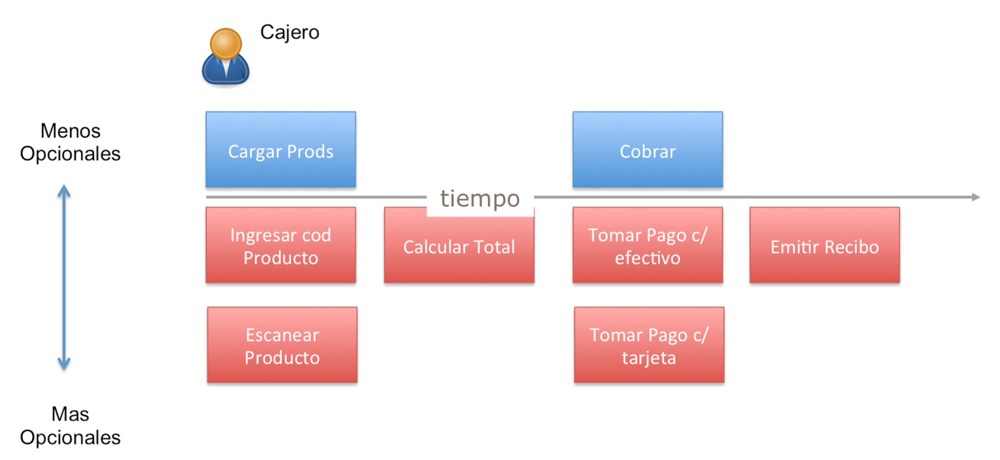

Hasta aquí, pudimos ver lo más importante referido a la herramienta. El resto no es más que seguir identificando flujos de tareas que los usuarios realizan. Cuando identificamos grupos de tareas relacionadas, abstraemos la actividad o proceso de negocio al que pertenecen. Si se tratasen de tareas alternativas \(o flujos de tareas\), pegaremos los _post-its_ debajo de las tareas principales. Esto se da bajo una conversación continua delante del _Story Map_, que va reflejando todo el conocimiento que adquirimos y que dispara nuevas charlas sin generar ninguna disrupción. Ahora, ¿ven por qué me gusta tanto?

**Recorriendo el *User Story Map***

Una vez finalizada la primera versión del _Story Map,_ deberíamos hacer algo que Jeff Patton denomina "Recorrer el story map", que implica la lectura de los *post-its* que representan cada una de las tareas, imaginando cómo el usuario trabajaría con el sistema. Podemos hacer este recorrido con diferentes personas, de manera de poder lograr diferentes opiniones. Por supuesto que, al recorrer el _Story Map_, descubriremos tareas olvidadas que obviamente agregaremos. ¡Los _post-its_ nos brindan esta flexibilidad!

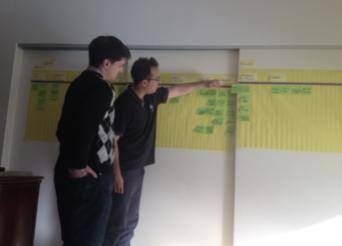

**Priorización Usando el *User Story Map***

Antes observamos que es posible especificar que una tarea es más importante que otra, simplemente poniendo la tarea \(o conjunto de tareas\) en un nivel superior del _Story Map_. ¡Genial! Además de eso, el Story Map es una herramienta muy útil para decidir cuál es la primera versión del producto que podemos poner en producción; lo que muchos llaman _Producto Mínimo Viable_ \(MVP - _Minimum Viable Product_\).

¿Cómo hacemos esto? Separando las tareas que estarán incluidas en el MVP de las que no. Para esto, bordeamos las tareas que pertenecen al MVP o simplemente trazamos una recta que deje los _post-its_ arriba o abajo según corresponda \(como muestra la imagen\).

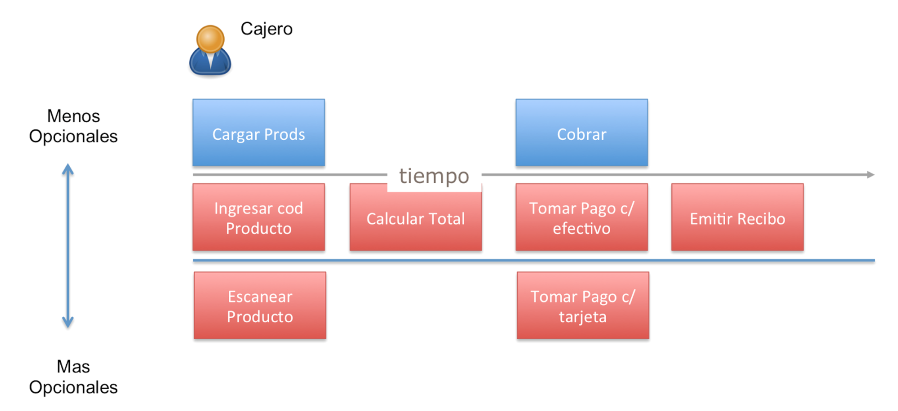

Decidir dónde debemos trazar la línea involucra muchísimos factores, muchos más de los que podría abordar en este capítulo. Lo importante a destacar es que la herramienta facilita la elección de una primera versión del MVP en un ambiente de colaboración, donde participan expertos de todas las áreas.

## **Lean Canvas**

¿Ustedes piensan que los desarrolladores deberían entender cómo funciona el negocio que modelarán? Algunos dirán que no es necesario: mientras se comunique correctamente lo que se debe desarrollar es suficiente. Podrán adivinar que estoy en desacuerdo con esta afirmación. Creo que es importante entender cómo funciona o funcionará el negocio de la empresa que nos contrata. Si estamos desarrollando un producto nuevo \(de un _startup_\), es necesario entender cuál es el modelo de negocios que piensan implementar o, dicho de otra manera, cómo piensan generar dinero. Si se trata de una aplicación para una organización, entonces debemos entender por qué es necesaria, cuál es su valor o cómo recortará costos.

En el pasado, eran frecuentes los planes de negocio extensos que requerían un gran esfuerzo. En la actualidad, es común el uso de una herramienta llamada _Lean Canvas,_ que es mucho más simple y liviana y, por ende, más atractiva para desarrollar en nuestros talleres.

_Lean Canvas_ es una herramienta que popularizó Eric Ries, a través de su metodología [Lean Startups](http://theleanstartup.com/book), que sirve para especificar el modelo de negocios de una manera muy simple y efectiva. La herramienta se enfoca en el problema detectado y en la solución que proporcione un valor agregado, no existente en el mercado. Se encuentran disponibles diferentes versiones, por ejemplo, en [leanstack](https://leanstack.com) pueden encontrar ésta \(ilustrada por la imagen\), definida como una adaptación del _business model canvas_ de Alex Osterwalder.

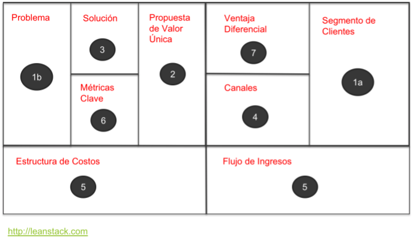

En el orden propuesto, iremos descubriendo:

1a\) A quiénes estará orientado el producto.

1b\) Los tres problemas más importantes que estos usuarios enfrentan. ¿Cómo los resuelven en la actualidad?

2\) Un mensaje simple, claro y atractivo que explique por qué tu solución es diferente y por qué valdría la pena comprarla.

3\) Los tres _features_ más importantes.

4\) Cómo llegar al cliente.

5\) Flujo de ingresos: qué se cobrará y cuánto.

6\) Cómo medir el progreso. Cómo saber si las hipótesis se cumplen.

7\) Cuál es la ventaja diferencial del producto \(aquella que los competidores no podrán alcanzar\).

En [canvanizer.com](https://canvanizer.com/new/lean-canvas), podemos encontrar una versión aún más reducida:

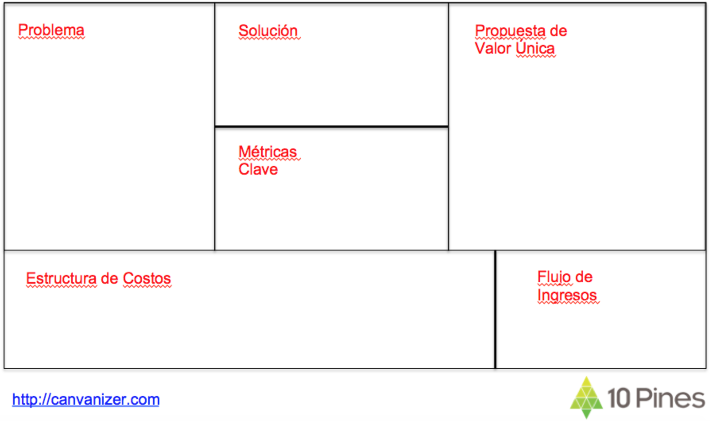

Mi colega Jorge Silva encontró un importante valor en el uso de esta herramienta en proyectos destinados a corporaciones, efectuándole algunos cambios, que incluyeron la adición de una sección de "Ahorros", que permite describir cómo se ahorrará dinero en ciertos procesos. En este [post](https://blog.10pines.com/2015/07/13/enterprise-lean-canvas/) podrán encontrar más detalles.

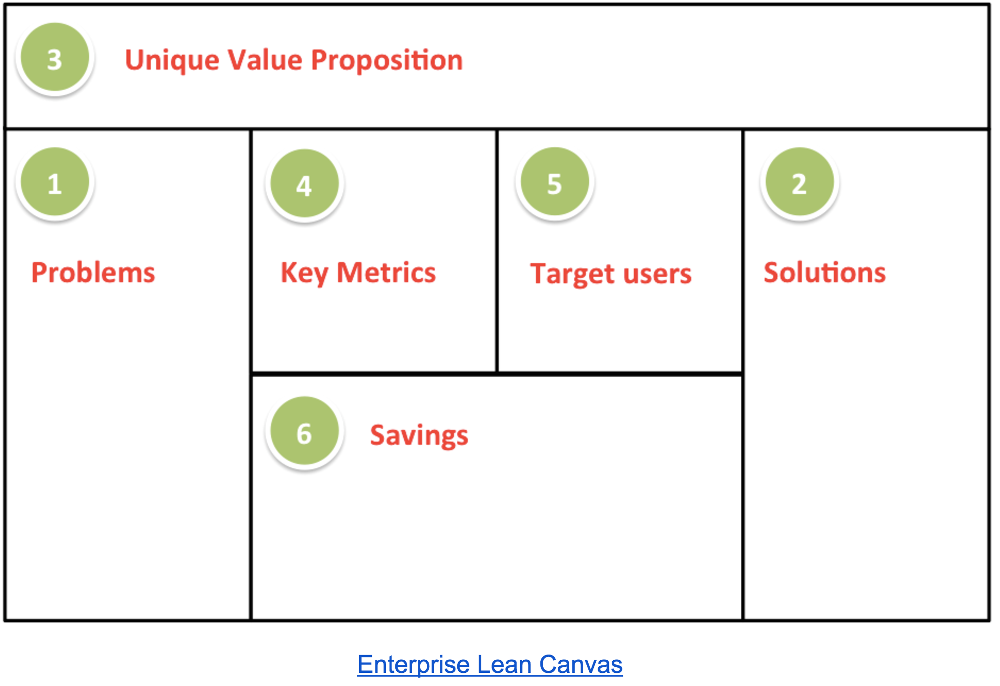

Tratar estos proyectos corporativos como si estuviesen destinados a un *startup* resulta un acierto, ya que evita caer en la trampa de pensar que el presupuesto es infinito y alinea las visiones de todas las áreas involucradas.

Hacer un taller que implique la creación del _Lean Canvas_, donde participe todo el equipo, permite que todas las personas que construirán el producto tengan una visión compartida del valor que agregará, cómo piensan venderlo y cuál es la competencia. El beneficio de contar con desarrolladores que comprendan la visión del negocio y de sus objetivos redunda en diseños pensados para alcanzarlos, el disparo de nuevas ideas (muchas veces no previstas) y en la propuesta de alternativas que busquen cumplirlos a un costo menor. En estos problemas complejos, la interacción de este grupo heterogéneo de profesionales es lo que maximiza las probabilidades de éxito.

## ***Elevator Pitch***

¿Cómo podríamos convencer a un inversor, en un lapso de tiempo muy breve \(por ejemplo, si compartiésemos el ascensor\), de que tenemos una idea que vale la pena implementar? Nuestro _pitch_ deberá resumir los conceptos claves del producto que tenemos en mente: los clientes y beneficios, qué pensamos hacer, cuál es nuestro diferencial y cuál es nuestra ventaja competitiva.

Nos gusta incluir este ejercicio en nuestros talleres, porque nos permite entender, de una manera muy resumida, cuál es el modelo de negocios que tendrá el producto a desarrollar. Para realizar este taller, entregamos al equipo un afiche con los siguientes campos a completar:

**Para** \(Clientes Claves\)

**Quiénes** \(Necesidad o Oportunidad\)

**El** \(Nombre del producto\)

**Es un** \(Tipo de aplicación o vertical\)

**Qué** \(Beneficios claves o razones más importantes por las que lo comprarían\)

**A diferencia de** \(Competidor principal\)

**Nuestro Producto** \(Diferencial\)

Ejemplos de _Elevator Pitchs_ desarrollados para algunos clientes:

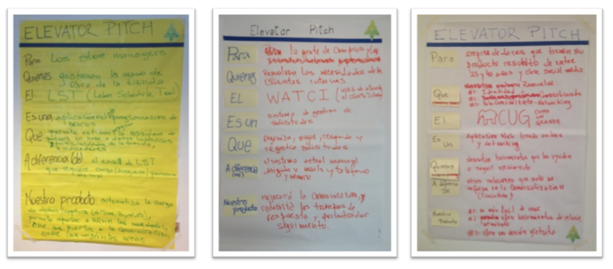

## ***Personas***

Uno de los objetivos que perseguimos en esta fase de _Product Discovery_ implica entender a los potenciales usuarios del sistema. ¿Quiénes son? ¿Qué tipos de usuario son? ¿Cómo encontrarán valor?

Una técnica muy útil para lograr conocimiento compartido en este sentido es la descripción de _Personas_ \(término técnico procedente del inglés\). Esta herramienta consiste en la identificación de un tipo de usuario del mundo real que intentaremos describir. Cómo es, cuáles son sus características \(por ejemplo, si es un usuario básico o uno avanzado\). Finalmente, describimos en pocas palabras cuál será el valor que el producto que vamos a desarrollar le brindará. Cabe destacar que esta _Persona,_ que usamos como ejemplo, representa en realidad un conjunto de usuarios que comparten las mismas características y que usarán el producto de modo similar.

Este ejercicio puede realizarlo el *Product Owner* \(o el _UX Designer_ en proyectos que cuenten con este rol\) para después informar sus conclusiones o puede efectuarse a través de un taller donde participe todo el equipo, incluyendo a los desarrolladores. ¡La diversidad de roles siempre enriquece el resultado!

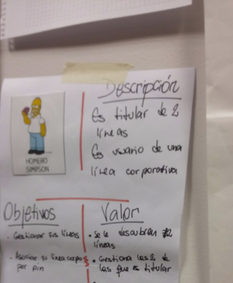

## **¿Qué nos quita el sueño?**

Siempre que un nuevo proyecto está por comenzar, existe un conjunto de incertidumbres o, dicho de otro modo, de riesgos que podrían hacer que el proyecto fracase. Es necesario que estos sean identificados cuanto antes. Esta actividad es breve \(se puede hacer en 15/20 minutos\) y permite que todos los involucrados hagan explícitos dichos riesgos, discutiéndose el potencial impacto de cada uno de ellos. El resultado de esta actividad será de gran ayuda en la priorización que deberá establecerse en el futuro, cuando se realice el planeamiento.

¿Cómo es la dinámica de la actividad? Básicamente, se trabaja sobre un papel de gran tamaño y _post-its_ que son entregados a todos los participantes. Durante 5’ cada integrante del equipo pensará y escribirá riesgos \(cada riesgo en un _post-it_\), pegándolos en el papel. Al finalizar este periodo, se leerán los riesgos que los integrantes del equipo han pensado y se discutirá la gravedad de cada uno de ellos, evaluándose cómo pueden ser mitigados.

## **Experimentos de usabilidad**

Una de las facetas a las que generalmente le prestamos menos atención y que, sin embargo, tiene mucha importancia es la de _Usabilidad_. Algo que muchos olvidan es que puede comenzar a evaluarse este aspecto sin escribir una sola línea de código y de manera muy económica. Aprender lo más rápido posible si los usuarios entienden la interfaz, qué _features_ consideran importantes y cuáles ni siquiera notan puede ahorrar una importante cantidad de recursos económicos.

### Cómo realizar un test de usabilidad en cinco pasos - por Juan Manuel Carraro

Muchas veces hay resistencias o limitaciones para realizar un test de usabilidad, sin todas las condiciones que indica la teoría. Es cierto que un *test* realizado por un consultor en usabilidad permitirá obtener mejores resultados, pero también es posible hacerlo internamente y hacerse de buena información. El requisito es cumplir ciertos criterios mínimos que aseguren una mayor consistencia metodológica y confiabilidad.

#### 1. Definir los objetivos del test

El primer paso consiste en definir cuáles son los objetivos del test. Un objetivo puede ser revisar la arquitectura de la información, los rótulos de determinadas secciones o saber si el proceso de compra que tenemos montado en nuestro sitio resulta intuitivo y fácil para los usuarios.

Los objetivos son sumamente importantes porque de ellos podremos derivar las tareas que los usuarios deberán realizar al momento de hacer el test. Por ejemplo: si nuestro objetivo es testear cuán intuitivo y fácil de navegar resulta el catálogo de productos que tenemos en nuestro sitio, una tarea podría ser solicitarle a los usuarios que encuentren un producto que cumpla con determinadas características.

#### 2. Construir el guión de tareas

Un guión se divide en conjuntos de preguntas y series de tareas, cada una de los cuales está vinculada a ciertos objetivos. Como mínimo, debe tener lo siguiente:

- **Introducción:** Aquí es donde el consultor o quien realice el test se presenta, le cuenta al usuario qué va a hacer, cuáles son los objetivos del test, etc. Dos ideas deben quedar claras para el usuario: pensar en voz alta, para que el consultor pueda tomar notas mientras trabaja, y tener en claro que no se está evaluando a la persona sino a la interfaz, por lo que los errores serán bienvenidos.
- **Cuestionario previo al test:** Aquí se trata de identificar o verificar el perfil del usuario. Algunas de las preguntas que se pueden incluir son: cuántas horas al día le dedica a Internet, qué tipo de sitios visita habitualmente o si realiza compras online.
- **Descripción de un escenario:** Como el contexto del test no deja de ser una situación artificial, que intenta reproducir las circunstancias reales, se le entrega al usuario información para situarlo en un determinado contexto. Por ejemplo, si estamos testeando un *Home Banking* con clientes que no pertenecen al mismo banco se les pide que actúen como si fueran clientes de la entidad y se les da información de sus cuentas, de su perfil o servicios contratados.
- **Tareas:** Las tareas constituyen el eje del guión y son aquellas acciones requeridas al usuario durante el test. Algunos ejemplos: agregar un producto al carrito de compra, ingresar al sitio con usuario y contraseña, registrarse, etc. Es sumamente importante que el usuario comente en voz alta lo que hace para que el consultor pueda tomar nota de sus dudas, dificultades o errores producidos durante el proceso.
- **Preguntas:** También pueden incluirse preguntas cerradas o abiertas dentro del test para conocer la opinión del usuario respecto a determinado elemento. Esto ayuda a evaluar elementos secundarios que por sus características no pueden testearse mediante tareas.
- **Cuestionario posterior al test:** Una vez que el usuario terminó de realizar todas las tareas y respondió todas las preguntas, se le solicita que exprese sus sensaciones y opiniones con respecto a la interfaz. Este segmento del guión de tareas es altamente cualitativo. Es importante incentivar a los usuarios para que se expresen y evitar el “Me pareció todo bien”.

#### *3. Identificar el perfil de los usuarios*

Uno de los factores que más influye en los resultados del test es que las personas que lo realicen sean lo suficientemente representativas del *target* del sitio. Para ello es importante trabajar previamente en la identificación de los rasgos y las cualidades de los usuarios teniendo en cuenta las diferentes dimensiones que componen un perfil:

- **Geográfica:** Analiza la ubicación geográfica de los usuarios.
- **Demográfica:** Analiza las características de los usuarios en tanto individuos sociales.
- **Psicográfica:** Procura conocer a la persona entera en su interacción con el ambiente.
- **Conductual:** Mide las actitudes de los usuarios hacia el consumo de un determinado producto o servicio en particular: la forma, el lugar y las ocasiones en que dicho consumo se produce.

Es incluso muy común que un sitio tenga diferentes segmentos de usuarios claramente identificables. En este caso es importante definir en primera instancia el perfil genérico y luego los perfiles particulares.

Siendo más específico, es posible vincular determinados perfiles con ciertas tareas: un perfil avanzado realizará tareas más complejas en comparación a las que un perfil novel pueda ejecutar.

#### **4. Realizar los tests**

Con un guión de tareas consistente, correctamente revisado y con al menos un par de usuarios de prueba, el test de usabilidad debería desarrollarse sin sobresaltos.

Es fundamental tener resueltas previamente todas las cuestiones logísticas para que no haya imprevistos durante las sesiones. Se deberá verificar que el ordenador funcione adecuadamente y tenga el prototipo o las páginas cargadas, que los dispositivos que utilicemos para grabar las sesiones (audio, video, grabadores de pantalla, etc.) funcionen bien y demás.

Cada sesión individual no debería durar más de una hora, sesiones más largas tienden a cansar al usuario y la atención decae. Normalmente es suficiente realizar un test con cinco usuarios, ya que así se identificarán cerca del 80% de los problemas de usabilidad.

Es recomendable realizar dos o tres sesiones en la mañana, tener un tiempo intermedio para registrar algunas notas y luego aprovechar las tardes para pasar en limpio la información completa de cada test, mientras todavía los detalles estén dentro del alcance de nuestra memoria.

#### **5. Redactar un informe**

El modo de organizar el informe final con los resultados es muy personal. En general, es recomendable comenzar por lo más destacado y terminar con los detalles. Esto ayuda a que si el informe debe ser leído por alguna persona con poco tiempo, en las primeras tres páginas pueda tener un resumen de lo más importante.

En el informe se deben clasificar los errores o problemas encontrados para luego poder priorizarlos y armar un plan de implementación de mejoras si fuese necesario. Las categorías deben ser simples y reducidas. Un ejemplo sería:

- **Problemas graves:** Aquellos que impiden al usuario concluir una tarea solicitada.
- **Problemas importantes:** Aquellos que permiten la conclusión de la tarea pero con un esfuerzo mayor al normal y luego de numerosos errores.
- **Problemas menores:** Aquellos que generan dudas o confusión en los usuarios, pero permiten realizar la tarea sin mucha demora.

También los errores pueden clasificarse por tipo: errores de la arquitectura de la información, del diseño o a nivel de los textos.

Algunos datos útiles para incluir son la cantidad de clics y el tiempo que les lleva a los usuarios realizar cada tarea. Esta información puede ayudar luego a extraer interesantes conclusiones.

Hasta aquí se han resumido muy sucintamente los pasos más importantes para realizar un test de usabilidad.

Si bien son importantes la habilidad y los conocimientos previos de quien prepare y realice el test, la experiencia ayudará a encontrar la mejor forma de conducirlo y obtener resultados cada vez más reveladores.

# **Conclusiones**

En este primer capítulo describí la primera fase de nuestro proceso de desarrollo: el _Product Discovery_. Todos nuestros proyectos comienzan con los talleres descritos, que **nos permiten crear una visión compartida de los objetivos** y **sentar las bases de una relación basada en la confianza donde fluya la comunicación**.

Todas las personas involucradas en el proyecto participan en estos talleres. Es importante escuchar todas las opiniones y saber que existe un alineamiento dentro de la empresa que pretende construir el producto. La interacción de todos estos perfiles, de negocios y técnicos, enriquece la conversación y potencia la innovación.

Realizar estos talleres en el proceso de preventa genera un grado de confianza que permite obtener fluidez, minimizando el desperdicio, ya que el desarrollo será una continuación que utilizará los mismos artefactos y se hará con las mismas personas que participaron del _Product Discovery_.

___

# Notas al pie

1. *The hardest single part of building a software system is deciding precisely what to build* - [[Brooks00]](bibliografia.md#brooks00-brooks-jr-frederick-the-mythical-man-month-agosto-1995)
2. *A User Story Mapping Example with David Hussman* - https://www.youtube.com/watch?v=LgIfrpvLM_Y
3. Extracto de "Diseño de experiencia de usuario (*UX*): Cómo diseñar interfaces digitales amigables para las personas y rentables para las compañías"- [[Carraro00]](bibliografia.md#carraro00-carraro-juan-manuel-duarte-yanina-diseno-de-experiencia-de-usuario-ux-como-disenar-interfaces-digitales-amigables-para-las-personas-y-rentables-para-las-companias-noviembre-2015)

